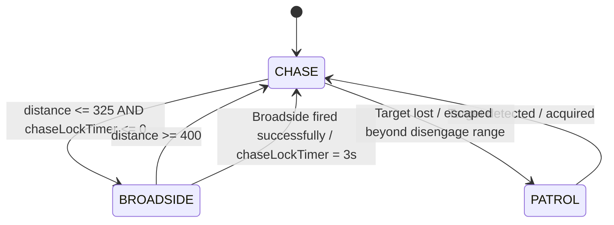

# AI State Machine

This document describes the current state machine used by the enemy ship AI in **Pirates of the Mediterranean**.

The purpose of this file is to provide a clear visual and technical representation of:

* The AI states.
* The conditions required to transition between states.
* Which states are already implemented.
* Which states are planned for future development.
* Important actions that happen inside states but are **not** states themselves.

> This document should be updated whenever an AI state or transition condition changes.

---

## Current State Machine



---

## Implementation Status

| State       | Status      |
| ----------- | ----------- |
| `CHASE`     | Implemented |
| `BROADSIDE` | Implemented |
| `PATROL`    | Planned     |

Currently, the AI starts directly in `CHASE`.

Once `PATROL` is implemented, it is expected to become the normal starting state.

---

# States

## CHASE

**Status:** Implemented

`CHASE` is currently the initial AI state.

While in this state, the AI:

* Points the bow of the ship toward the Player.
* Moves toward the Player.
* Adjusts speed according to the distance from the Player.
* Slows down or brakes when necessary.
* Can fire the front cannon bank when the firing conditions are satisfied.

### Transition to BROADSIDE

```text
CHASE → BROADSIDE
```

Condition:

```text
distance <= 325
AND
chaseLockTimer <= 0
```

The AI may enter `BROADSIDE` only when:

1. The Player is within Broadside engagement range.
2. The temporary Chase lock has expired.

The Chase lock prevents the AI from immediately entering another Broadside after completing the previous one.

---

## BROADSIDE

**Status:** Implemented

In `BROADSIDE`, the AI attempts to position one side of the ship toward the Player and fire a Broadside.

While entering or operating in this state, the AI:

* Chooses which side of the ship should face the Player.
* Turns the ship toward the desired Broadside orientation.
* Attempts to achieve a valid firing angle.
* Fires the corresponding cannon bank once firing conditions are satisfied.

The decision between **Left Broadside** and **Right Broadside** happens internally inside this state.

They are not separate AI states.

---

### Transition to CHASE — Target Too Far

```text
BROADSIDE → CHASE
```

Condition:

```text
distance >= 400
```

If the Player moves too far away while the AI is attempting to Broadside, the AI stops trying to maintain the Broadside position and returns to pursuit.

---

### Transition to CHASE — Successful Broadside

```text
BROADSIDE → CHASE
```

Condition:

```text
Broadside fired successfully
```

After a successful Broadside:

```text
chaseLockTimer = 3 seconds
```

The AI therefore returns to `CHASE` and must remain outside `BROADSIDE` for at least 3 seconds.

This prevents behaviour such as:

```text
BROADSIDE
→ Fire
→ BROADSIDE
→ Fire
→ BROADSIDE
→ Fire
```

and forces the ship to move and reposition between attacks.

---

## PATROL

**Status:** Planned — Not Implemented

`PATROL` will represent the default non-combat navigation behaviour of an AI ship.

The exact Patrol behaviour has not yet been designed.

Conceptually, while in this state the ship will move through the map without actively pursuing a target.

---

### Planned Transition to CHASE

```text
PATROL → CHASE
```

Planned condition:

```text
Target detected / acquired
```

The exact target detection system has not yet been defined.

Possible factors may later include:

* Detection radius.
* Line of sight.
* Target validity.
* Target selection rules.

These conditions should not be considered final yet.

---

### Planned Transition from CHASE to PATROL

```text
CHASE → PATROL
```

Planned condition:

```text
Target lost / escaped beyond disengage range
```

The exact disengage distance and target-loss rules have not yet been defined.

---

# Actions That Are Not States

Some AI behaviours happen inside a state and therefore should **not** be represented as separate states in the state machine.

## Front Fire

`Front Fire` is an action available during `CHASE`.

It is **not** a state.

Conceptually:

```text
CHASE
    ↓
Player inside front cannon range
AND
Player aligned with bow
AND
Front cannon bank ready
    ↓
Fire front cannons
    ↓
Remain in CHASE
```

The AI does not change state when firing the front cannons.

---

## Choose Broadside Side

Choosing between:

```text
LEFT
```

and:

```text
RIGHT
```

is an internal decision performed during `BROADSIDE`.

It is **not** currently represented as:

```text
LEFT_BROADSIDE
RIGHT_BROADSIDE
```

or as separate states.

The selected side only affects how the AI positions and rotates the ship inside the existing `BROADSIDE` state.

---

# Transition Summary

| From        | To          | Condition                                 | Status      |
| ----------- | ----------- | ----------------------------------------- | ----------- |
| Start       | `CHASE`     | AI initialized                            | Implemented |
| `CHASE`     | `BROADSIDE` | `distance <= 325 AND chaseLockTimer <= 0` | Implemented |
| `BROADSIDE` | `CHASE`     | `distance >= 400`                         | Implemented |
| `BROADSIDE` | `CHASE`     | Broadside fired successfully              | Implemented |
| `PATROL`    | `CHASE`     | Target detected / acquired                | Planned     |
| `CHASE`     | `PATROL`    | Target lost / beyond disengage range      | Planned     |

---

# Important Values

Current AI state transition values:

```text
Broadside Entry Distance: 325
Broadside Exit Distance: 400
Post-Broadside Chase Lock: 3 seconds
```

The difference between the entry and exit distances creates hysteresis:

```text
Enter BROADSIDE at <= 325

Exit BROADSIDE at >= 400
```

This prevents the AI from rapidly switching between `CHASE` and `BROADSIDE` when the Player is close to the engagement boundary.

---

# Development Rule

Whenever AI behaviour changes, this file must be checked.

Update this document when:

* A new state is introduced.
* A state is removed.
* A transition is added or removed.
* A transition condition changes.
* A timer or distance affecting a transition changes.
* An internal action is promoted into a full state.
* A planned state becomes implemented.

The Mermaid diagram should always represent the current AI architecture.
