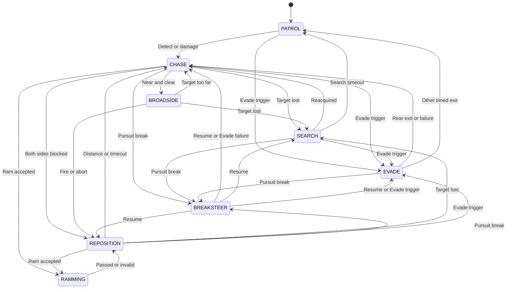

# AI State Machine

This document describes the implemented enemy ship AI state machine in **Pirates of the Mediterranean**.

The current implementation controls one EnemyShip with PlayerShip assigned as its target. The planned survival mode will use multiple enemies in waves; wave spawning and match progression are outside the scope of this state machine.

This document describes:

- The AI states and their responsibilities.
- The conditions and priorities of transitions between states.
- Actions and supporting systems that are not states.
- Current implementation limits and planned AI behavior.

> Update this document whenever an AI state, transition, or decision rule changes.

---

## Current State Machine

The diagram summarizes implemented state transitions. Its labels are abbreviated; the sections below define their exact conditions and priority. BreakSteer resumes the particular state it interrupted.

---

## Implementation Status

| State | Status |
|---|---|
| `PATROL` | Implemented; initial state |
| `CHASE` | Implemented |
| `BROADSIDE` | Implemented |
| `REPOSITION` | Implemented |
| `SEARCH` | Implemented |
| `EVADE` | Implemented |
| `RAMMING` | Implemented |
| `BREAKSTEER` | Implemented |

`AIController` coordinates these state objects. The current EnemyShip targets PlayerShip; wave spawning and coordination between multiple enemies are not implemented yet.

---
# States

## PATROL

**Status:** Implemented; initial state.

In `PATROL`, the EnemyShip sails toward an assigned PatrolPoint at full throttle. When it comes within 20 units of that point, it selects a connected point. If several connections are available, it avoids immediately returning to the previous point.

### Transitions from PATROL

- **PATROL → CHASE:** The assigned PlayerShip is detected within 1100 units, passes the Patrol field-of-view check, and is visible along the line of sight.
- **PATROL → CHASE on damage:** Damage can trigger pursuit even when the player is behind the Patrol blind spot. If that damage also meets the Evade conditions, **EVADE takes priority** instead.

Patrol has a 240° field of view, leaving a 120° blind region behind the ship. Detection also requires a valid target, sufficient range, and an unobstructed line of sight. The current AI checks its assigned PlayerShip; it does not search among ships to choose a target.

---

## CHASE

**Status:** Implemented.

In `CHASE`, the AI steers its bow toward the PlayerShip, approaches it, and adjusts throttle according to distance. It may fire the front cannon bank when its firing conditions are met.

### Transitions from CHASE

- **CHASE → RAMMING:** A valid ramming opportunity is accepted. This decision is checked before Broadside entry.
- **CHASE → BROADSIDE:** The player is within 325 units, Ramming was not accepted, and at least one candidate Broadside maneuver is unblocked.
- **CHASE → REPOSITION:** The player is within 325 units, Ramming was not accepted, and both candidate Broadside maneuvers are blocked.
- **CHASE → SEARCH:** The target has not been visible under combat perception for 2 seconds.
- **CHASE → EVADE:** Damage triggers the Evade conditions.
- **CHASE → BREAKSTEER:** The sustained close-pursuit conditions are met and an escape turn is available.

There is no `chaseLockTimer` and no direct `CHASE → PATROL` transition on target loss.

---

## BROADSIDE

**Status:** Implemented.

Before entering `BROADSIDE`, `AIController` chooses the Left or Right side. It checks whether the preferred maneuver is blocked and can use the other side instead. The selected side determines both how the ship aligns and which cannon bank it fires.

During `BROADSIDE`, the AI turns to align the selected side with the player. While the ship has sufficient forward speed, it updates its aim direction toward the player's current position. When forward speed falls to 2 or below, it locks that direction for the remainder of the attempt. The player can therefore move away from the stored aim direction and cause the volley to miss.

### Transitions from BROADSIDE

- **BROADSIDE → CHASE:** The player moves to a distance of 400 units or more.
- **BROADSIDE → SEARCH:** The target has not been visible under combat perception for 2 seconds.
- **BROADSIDE → REPOSITION:** The AI calls `Fire` after meeting its range, alignment, and cooldown conditions.
- **BROADSIDE → REPOSITION:** The attempt reaches its 5.5-second timeout, its stored aim direction is invalid, or shoreline avoidance remains active for 1.5 seconds.

The transition after firing does not require the cannonballs to hit. There is no three-second Chase lock.

---

## REPOSITION

**Status:** Implemented.

In `REPOSITION`, the AI requests full forward throttle and no steering to create space after a Broadside attempt. Shoreline obstacle avoidance may override those requested controls.

The Reposition timer starts when the AI enters this state and is reset on each new entry.

### Transitions from REPOSITION

- **REPOSITION → RAMMING:** A valid Ramming opportunity is accepted. This is checked before the normal Reposition exit.
- **REPOSITION → CHASE:** The player is at least 400 units away, or the Reposition timer reaches 8 seconds.
- **REPOSITION → SEARCH:** The target has not been visible under combat perception for 2 seconds.
- **REPOSITION → EVADE:** Damage triggers the Evade conditions.
- **REPOSITION → BREAKSTEER:** The sustained close-pursuit conditions are met and an escape turn is available.

If BreakSteer interrupts Reposition, its timer pauses and resumes when the AI returns.

---

## SEARCH

**Status:** Implemented.

The AI enters `SEARCH` after losing sight of the PlayerShip for 2 seconds during Chase, Broadside, or Reposition. It sails toward the player's last known position.

When the AI comes within 100 units of that position, it begins a 6-second search. During this period it requests straight movement at throttle 0.2, rather than stopping.

### Transitions from SEARCH

- **SEARCH → CHASE:** The player is detected again within 1100 units using combat perception.
- **SEARCH → PATROL:** The AI reaches the search area and completes 6 seconds of searching without detecting the player.
- **SEARCH → EVADE:** Damage triggers the Evade conditions.
- **SEARCH → BREAKSTEER:** The sustained close-pursuit conditions are met and an escape turn is available.

The search timer starts **on arrival**, not when entering `SEARCH`. If BreakSteer interrupts Search, the state's timer pauses and resumes afterward.

---

## EVADE

**Status:** Implemented.

Evade is evaluated when the AI receives damage. It may enter `EVADE` after either:

- 3 damage events within 2.5 seconds; or
- HP falls to 30% or less.

Entry also requires the 6-second Evade cooldown to have expired. Damage received during `BROADSIDE` or `RAMMING` does not interrupt those states to enter Evade. Low HP by itself does not trigger Evade on every update; a damage event must occur.

In `EVADE`, the ship first turns away from the player. It then sails toward a selected PatrolPoint intended to take it farther from the fight. Evade does not restore HP.

### Transitions from EVADE

- **EVADE → CHASE:** After at least 5 seconds in Evade, 2 hits within 3 seconds cause Evade to fail.
- **EVADE → CHASE:** When Evade ends normally, the player is visible under combat perception but lies in Patrol's rear blind region.
- **EVADE → PATROL:** Evade ends normally and the rear-blind-region condition above does not apply.
- **EVADE → CHASE:** No usable Evade waypoint is available.
- **EVADE → BREAKSTEER:** The sustained close-pursuit conditions are met and an escape turn is available. Evade is suspended rather than restarted.

Evade ends normally after at least 12 seconds in the state and 4 seconds without damage, or when its active duration reaches 25 seconds. Its 6-second cooldown begins when Evade actually ends, not when BreakSteer temporarily suspends it.

While BreakSteer suspends Evade, Evade's active-duration timer pauses. During suspension, damage updates the last-damage time. It counts toward Evade failure only if Evade's paused active-duration timer has already reached 5 seconds; two such hits within 3 seconds cause failure.

---

## RAMMING

**Status:** Implemented.

The AI may enter `RAMMING` only from `CHASE` or `REPOSITION`. `AIRammingEvaluator` first checks whether the ships' predicted paths create a suitable interception opportunity. It rejects a head-on approach or a shoreline-blocked path. A valid opportunity is accepted with a 25% chance.

On entry, the AI stores an interception point and sails toward it at full throttle. Within 150 units of the player, it may make a small direct correction if the required angle is no greater than 20° and that direction is unblocked.

The physical collision and its damage are handled by the separate `ShipRammingDamage` component. Entering `RAMMING` does not guarantee a hit.

### Transition from RAMMING

- **RAMMING → REPOSITION:** The stored intercept is invalid, or the ship passes the interception plane. Passing that plane ends the attempt whether the ships collided or the Ram missed.

Losing line of sight does not automatically end `RAMMING`. The state has no separate timeout.

The 7-second Ramming decision interval starts after a failed 25% chance roll or after a Ramming attempt ends. If an opportunity fails the geometric checks, that interval does not start.

---

## BREAKSTEER

**Status:** Implemented.

`BREAKSTEER` is a temporary maneuver used when the player remains close behind or beside the EnemyShip while sailing in a similar direction. It can interrupt `CHASE`, `REPOSITION`, `SEARCH`, or `EVADE`. It cannot start from `PATROL`, `BROADSIDE`, or `RAMMING`.

The pursuit conditions must remain true for 6 consecutive seconds:

- The player is within 500 units.
- The player is within 100° of the EnemyShip's rear direction.
- The ships' horizontal headings differ by no more than 60°.

The check is based on position and heading, not relative speed. On entry, the AI saves its previous state and chooses a usable left or right turn, checking for shoreline obstacles. It turns approximately 90°, then sails at full throttle for 3 seconds.

### Exit from BREAKSTEER

- **BREAKSTEER → saved state:** Once the turn is within 10° of its target heading and the subsequent 3-second escape run is complete, the AI resumes the state it interrupted.

Resuming `REPOSITION`, `SEARCH`, or `EVADE` does not restart that state's timer. Suspending Evade does not start its cooldown.

Damage can cause a different transition while BreakSteer is active: an Evade trigger may replace a suspended non-Evade state with a new Evade, while damage that causes a suspended Evade to fail cancels BreakSteer and leads to `CHASE`.

---

# Actions That Are Not States

## Front Fire

Front Fire is an action performed during `CHASE`, not a separate AI state. The AI may request front cannon fire when the player is within 600 units, within 5° of the bow, and the front cannon bank is ready. Firing does not itself change the state.

Transitions checked before the Chase movement and firing action can prevent that action from running on a particular tick.

---

## Choose Broadside Side

Left and Right Broadside are choices, not separate states. `AIController` selects a side before entering `BROADSIDE`, checks the candidate maneuver against shoreline obstacles, and passes the selected side to the state. That choice affects both the ship's alignment and the cannon bank used for the volley.

---

# Transition Summary

The table summarizes implemented transitions. Damage-triggered Evade transitions can occur outside the regular AI update. When several conditions apply in one update, their evaluation order matters; the diagram alone does not express that priority.

| From | To | Condition |
|---|---|---|
| Start | `PATROL` | AI initialized |
| `PATROL` | `CHASE` | Player detected, or damage received without an Evade trigger |
| `PATROL` | `EVADE` | Damage triggers Evade |
| `CHASE` | `RAMMING` | Ramming opportunity accepted |
| `CHASE` | `BROADSIDE` | Distance ≤325 and at least one Broadside maneuver is unblocked |
| `CHASE` | `REPOSITION` | Distance ≤325 and both Broadside maneuvers are blocked |
| `CHASE` / `BROADSIDE` / `REPOSITION` | `SEARCH` | Target not visible for 2 seconds |
| `BROADSIDE` | `CHASE` | Distance ≥400 |
| `BROADSIDE` | `REPOSITION` | Fire requested, 5.5-second timeout, invalid aim, or avoidance active for 1.5 seconds |
| `REPOSITION` | `RAMMING` | Ramming opportunity accepted |
| `REPOSITION` | `CHASE` | Distance ≥400 or 8-second timeout |
| `SEARCH` | `CHASE` | Player detected again |
| `SEARCH` | `PATROL` | Search area reached, then 6 seconds pass without reacquisition |
| `CHASE` / `REPOSITION` / `SEARCH` | `EVADE` | Damage triggers Evade |
| `EVADE` | `CHASE` | Evade fails, no waypoint is available, or timed exit finds the player visible under combat perception within 1300 units and in Patrol's rear blind region |
| `EVADE` | `PATROL` | Other timed Evade exit |
| `CHASE` / `REPOSITION` / `SEARCH` / `EVADE` | `BREAKSTEER` | Pursuit conditions persist for 6 seconds and a turn is available |
| `BREAKSTEER` | Previous state | Turn and escape run complete, unless a damage-triggered transition interrupts it |
| `BREAKSTEER` | `EVADE` | Damage triggers Evade while the suspended state is not Evade |
| `BREAKSTEER` | `CHASE` | Damage causes the suspended Evade to fail |
| `RAMMING` | `REPOSITION` | Stored intercept is invalid, or the ship passes the interception plane |

Ramming entry is checked before Broadside entry in `CHASE` and before the normal exit from `REPOSITION`. BreakSteer entry is checked before the target-loss and state-specific transitions. A damage-triggered Evade decision can also interrupt eligible states.

---

# Important Values

| Rule | Current value |
|---|---:|
| Patrol detection range | 1100 |
| Combat visibility retention range | 1300 |
| Patrol field of view | 240° |
| Combat field of view | 360° |
| Broadside entry distance | 325 |
| Broadside exit / Reposition exit distance | 400 |
| Target-loss grace period | 2 seconds |
| Broadside attempt timeout | 5.5 seconds |
| Broadside aim-lock forward speed | ≤2 |
| Reposition timeout | 8 seconds |
| Search arrival distance | 100 |
| Search duration after arrival | 6 seconds |
| Evade minimum / maximum active duration | 12 / 25 seconds |
| Evade damage-free exit period | 4 seconds |
| Evade cooldown after exit | 6 seconds |
| Ramming decision interval after a failed chance roll or completed Ram | 7 seconds |
| Ramming acceptance chance for a valid opportunity | 25% |
| BreakSteer pursuit duration | 6 seconds |
| BreakSteer escape run after turning | 3 seconds |

The 325/400 distance gap helps prevent rapid switching at the Broadside boundary. There is **no post-Broadside Chase lock**.

The Search duration starts only after reaching the search area. Evade duration pauses while BreakSteer suspends it. A geometrically invalid Ramming opportunity does not start the seven-second decision interval.

---

# Development Rule

Check and update this document whenever an AI state, transition, priority, timer, range, or supporting decision rule changes. Keep the Mermaid diagram, transition table, and state descriptions consistent with the implemented behavior. Mark future behavior as planned until it is implemented.