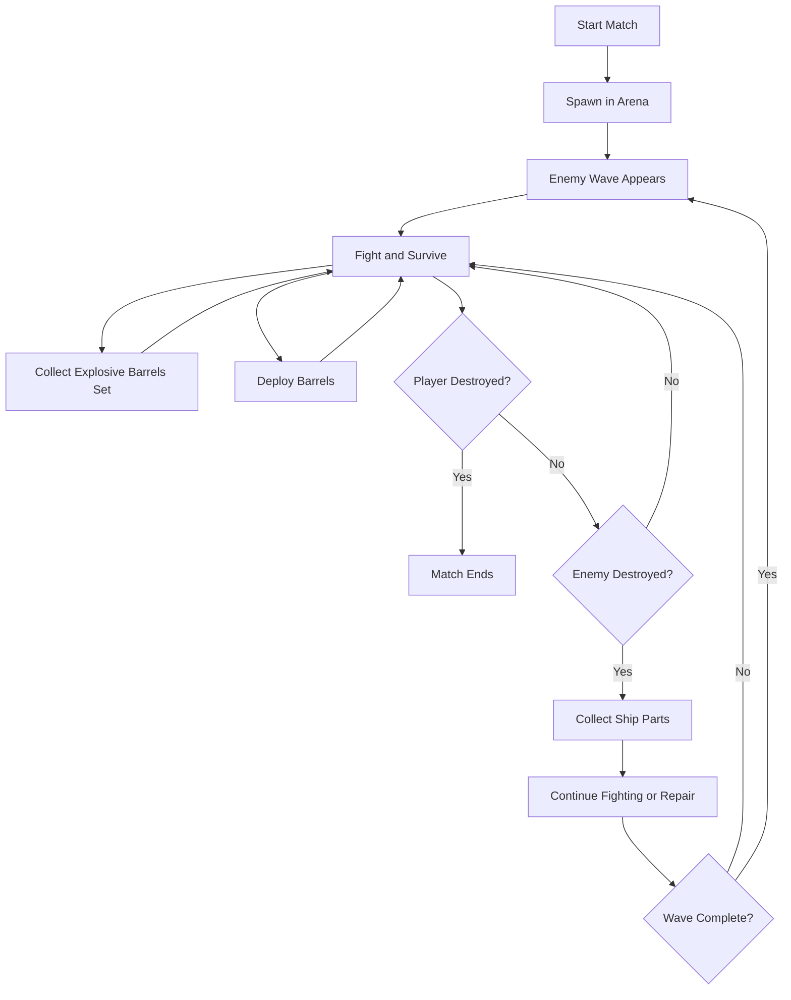
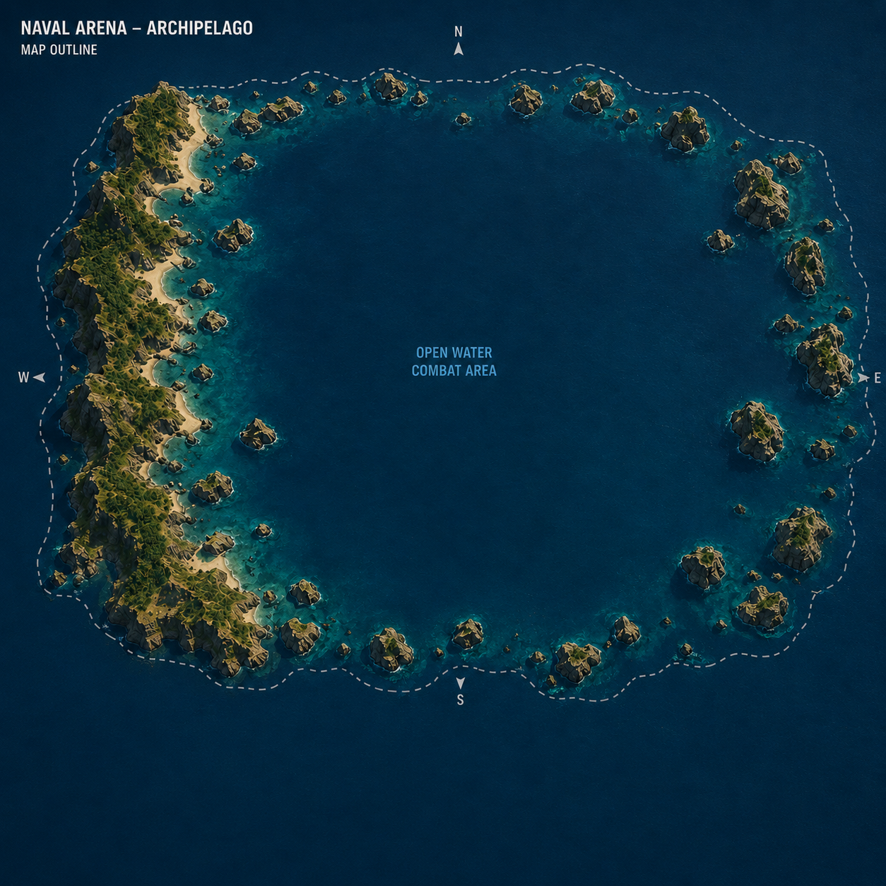
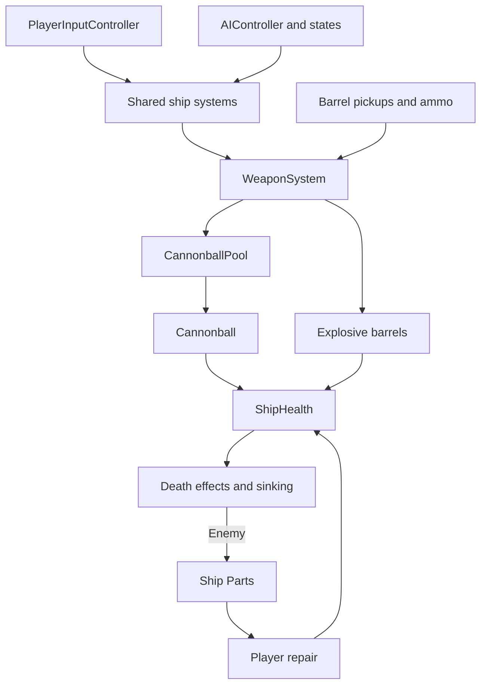

# Pirates of the Mediterranean - GDD

| | |
|---|---|
| **Working title** | Pirates of the Mediterranean |
| **Team** | Roy Tomer |
| **Genre** | 3D Naval Combat / Arcade Survival |
| **Target platform** | PC - Windows and macOS |
| **Engine / Unity version** | Unity 6, URP, 3D |
| **Orientation & reference resolution** | Landscape, 1920 × 1080 |
| **Expected session length** | TBD — survival-based |
| **Document version** | v0.3 - 2026-09-25 |

## 1. High Concept

**Pirates of the Mediterranean** is a 3D single-player naval combat game set in a stylized pirate-era archipelago. The player fights successive waves of AI-controlled enemy ships, aiming to survive for as long as possible. Combat focuses on maneuvering, positioning, directional cannon fire, broadside attacks, ramming, and collecting resources such as Ship Parts and Explosive Barrels Sets.

### Design Pillars

- **Positioning-Based Combat** - maneuvering and firing angles are central to survival.
- **Simple Controls, Tactical Choices** - the ship remains easy to control while combat and resources give the player meaningful choices.
- **Escalating Survival** - successive waves of enemy ships increase the pressure on the player and reward sustained combat and resource management.

## 2. Core Game Loop

The planned match loop is survival against successive waves of enemy ships. The player fights, collects Ship Parts from defeated enemies to repair the ship, and collects Explosive Barrels Sets that appear in the arena to deploy in combat while trying to survive for as long as possible.

Ship movement, cannon combat, HP/damage, ship death, combat against one AI-controlled enemy, Ship Parts loot and repair, and Explosive Barrels Set pickups and deployment are implemented. Wave spawning, match-level defeat, and scoring are planned.

The rules for completing a wave, starting the next wave, and measuring the player's survival performance are still to be defined.

### Moment-to-Moment Rules

- The player moves and steers the ship to create better attack angles and avoid damage.
- Cannons fire in the selected direction, subject to that firing side's cooldown.
- The AI checks range and angle before firing. A general firing-range limit for the player's cannons is planned but not yet implemented.
- Broadside attacks reward good side positioning.
- Ramming damage currently depends on collision closing speed; ship size is not part of the implemented damage calculation.
- Defeated enemy ships drop Ship Parts that the player can collect.
- The player can spend collected Ship Parts to repair the ship.
- The player can collect Explosive Barrels Sets and deploy a group of four barrels in combat.
- The player survives successive enemy waves until the player ship is destroyed.

### Parameters to Tune

Current values from the ship configuration and connected assets:

| Group | Parameter | Current value |
|---|---|---:|
| Movement | `acceleration` | 20 |
| Movement | `brakeAcceleration` | 3 |
| Movement | `lateralDrag` | 8 |
| Movement | `turnAcceleration` | 1.25 |
| Movement | `maxTurnSpeed` | 0.4 |
| Movement | `fullSteeringSpeed` | 20 |
| Combat | `maxHealth` | 100 |
| Combat | `cooldownDuration` | 4 |
| Combat | `extraCooldownPenalty` | 2 |
| Combat | `cannonballSpeed` | 200 |
| Projectile | Cannonball `damage` | 5 |

Death and sinking effects have their own settings. The current sequence uses explosions followed by a slow roll, a faster capsize, and sinking. The old `sinkingStartDelay` value of 8 seconds is a fallback when death effects do not start the sinking sequence; `rollDuration` is a legacy value and does not describe the current roll sequence.

Additional values and open design decisions:

| Parameter | What it controls | Value |
|---|---|---|
| Player cannon range | Whether and when the player's cannon fire is range-limited | TBD |
| Enemy wave size and progression | How enemies appear and when the next wave begins | TBD |
| Ship Parts drop amount | Parts awarded per defeated enemy | 1 |
| Repair cost and amount | Parts spent and HP restored per repair | 1 Part; up to 25% of maximum HP |
| Explosive Barrels Set spawning | When pickups appear and maximum active pickups | Initial pickup, then 17% every 30 seconds; maximum 2 active |
| Radar range | Which enemies appear on the minimap / radar | TBD |

**Where these live:** shared ship tuning is stored in `ShipConfig` and referenced by `ShipConfiguration`. Projectile, death-effect, and AI settings are configured separately. Ship Parts, repair, and barrel values are configured in their respective components. Wave values will be assigned when that system is designed.

## 3. Controls & Input

The player controls the ship from a third-person perspective. The controls below are implemented.

| Action | Keyboard / Mouse |
|---|---|
| Move forward | `W` |
| Brake | `S` |
| Turn left | `A` |
| Turn right | `D` |
| Cycle firing direction | `Q` |
| Toggle Main Camera / Firing Camera | `E` |
| Hold rear view | `Tab` |
| Fire selected cannons | `Left Mouse Button` / `Space` |
| Repair using Ship Parts | `R` |
| Deploy Explosive Barrels Set | `F` |
| Rotate Main Camera | Mouse |

`S` slows the ship; it does not provide normal reverse movement. Steering effectiveness depends on forward speed, so the ship cannot turn in place.

The selected firing direction cycles through:

`Front → Right → Left → Front`

The selected direction is shown on the HUD. While the Firing Camera is active, changing the firing direction also switches to its corresponding camera view.

### Camera

The game uses two camera modes:

- **Main Camera** — a custom third-person `CameraFollow` system positioned behind and above the ship. The player can rotate it horizontally with the mouse; it smoothly returns toward the ship heading after inactivity.
- **Firing Camera** — a combat camera aligned with the selected firing direction: Front, Right, or Left.

Pressing `E` toggles between the Main Camera and Firing Camera. Holding `Tab` shows a rear view; releasing it returns to the Main Camera. The rear view is a camera view, not a fourth firing direction.

`CameraModeController` handles switching between the camera views. Cinemachine is not currently used.

## 4. Combat Mechanics

Combat is based on maneuvering the ship into effective positions and choosing the correct attack direction.

### Cannons

- Ships fire in three directions: Front, Right, and Left.
- The current scene gives the player 6 firing points on each side. The enemy uses 4 on each side and 2 at the front. These are the current scene configurations.
- Side cannons are used for broadside attacks.
- The AI checks range and angle before deciding to fire. The player's firing is currently limited by the selected direction's cooldown, not by target detection or target range. A player firing-range rule remains planned.
- Cannons use cooldowns rather than limited ammunition.
- Front, Left, and Right have separate cooldown timers. The current base cooldown is 4 seconds per direction.
- Firing a ready direction while another direction is cooling down adds a 2-second penalty to the newly fired direction's cooldown and to each active cooldown. Other ready directions receive no penalty.

### Ramming

Collision-based ramming damage is implemented for ships. The AI can also choose a Ramming maneuver during combat; that decision is separate from the shared collision-damage system.

- A collision must meet the minimum closing-speed requirement to deal ramming damage.
- Damage is calculated from closing speed, with a maximum damage cap. The rammer may also take a smaller amount of self-damage.
- Ship size and mass are not inputs to the current damage calculation.

### Explosive Barrels

- The player collects Explosive Barrels Sets from pickups in the arena.
- Pressing `F` spends one set and deploys a group of four barrels, subject to a 1-second cooldown.
- Once the barrels are floating, they spread out and detonate when a ship comes close. Each affected ship takes damage once per group.
- The deploying ship is temporarily protected from its own barrels.
- Planned: a destroyed ship cannot deploy an Explosive Barrels Set.

### Damage and Destruction

- Each ship has HP. Taking damage reduces HP.
- When HP reaches zero, the ship can no longer move or fire, and the lethal hit position is recorded.
- A three-point death sequence uses Bow, Middle, and Stern explosion points. The point nearest the lethal hit determines the order:
  - Bow hit: Bow → Middle → Stern
  - Middle hit: Middle → Bow → Stern
  - Stern hit: Stern → Middle → Bow
- Explosions occur 1 second apart. Smoke begins approximately 0.7 seconds after each explosion.
- The final explosion starts a slow roll, followed by a faster capsize and then sinking. The ship rolls toward the side determined by the lethal hit; centerline hits may choose either side.
- The slow roll reaches approximately 15° over 5 seconds. The faster capsize continues toward 80°. The ship drops during the roll, then sinks to a depth of approximately 30 units below its death position.
- The 8-second sinking delay is a fallback when the death effects do not start the sinking sequence.

Local ship death and sinking are implemented. Tracking the end of a survival match when the player is destroyed is planned.

### Repair

Ship Parts collection and player repair are implemented.

- Each defeated enemy ship drops one Ship Parts pickup after sinking. Collecting it adds one Part to the player's inventory.
- Pressing `R` spends one Part to restore up to 25% of maximum HP, without exceeding maximum health.
- A destroyed ship or a ship at full health cannot repair.

## 5. AI Behavior

Combat against one AI-controlled enemy ship is implemented and has been tested in complete battles against the player. The current enemy targets the player. Multiple simultaneous enemies and wave spawning are planned.

The current AI can:

- Patrol the arena and detect the player using range, field of view, and line of sight.
- Chase, fire, position for broadsides, and reposition during combat.
- Search for the player after losing sight of them.
- Evade under pressure, attempt ramming maneuvers, and break away when pursued closely.
- Navigate between Patrol Points and avoid shoreline obstacles.
- React to damage and recover from suitable frontal contact with ships or the shoreline.

The planned wave system will bring several enemy ships into the arena to fight the player. Spawn placement, wave progression, and enemy scaling still require design decisions.

The AI's states, transitions, and decision rules are documented separately in `AI_StateMachine.md`.

## 6. Map & Arena

The game takes place in a single naval arena. The current `GameScene` includes the ocean, islands, rock formations, and a large open-water combat area.

A long archipelago or coastline forms a natural boundary along one side of the map. Smaller islands and rock formations enclose the other sides. The arena leaves room for maneuvering, broadside attacks, and ramming, with landforms that can affect visibility and movement.

The map includes shoreline collision boundaries and a connected Patrol Points graph used by the enemy AI. The AI detects and steers around shoreline obstacles during navigation.

### Map Concept

The sketch below shows the original layout concept. The implemented arena is represented by the current `GameScene`.

## 7. HUD & UI

The in-game HUD presents the information the player needs during combat without obstructing the view.

Currently implemented:

- **Player ship HP**
- **Selected firing direction**
- **Cooldown status for each firing direction**
- **Enemy HP and distance**, shown when the enemy is visible
- **Current amount of Ship Parts**
- **Current number of Explosive Barrels Sets**

Planned for the survival wave system:

- **Current wave**
- **Enemies remaining in the current wave**, if waves end when all their enemies are defeated
- **Minimap / Radar**
- **Survival time or score**, depending on the match progression rules still to be decided

### Screens

The current Gameplay Screen contains the combat view and the implemented HUD elements.

Planned screens:

- **Main Menu** — starts a new match.
- **Game Over** — shows the player's survival result after the ship is destroyed, with options to restart or return to the menu.

## 8. Technical Design

The game separates player and AI decisions from the shared systems that move ships, fire weapons, apply damage, and play death effects.

### Scenes

- `GameScene` (current) — contains the arena, PlayerShip, one EnemyShip, combat and pickup systems, cameras, and the current HUD.
- `MainMenu` (planned) — starts a survival match.

Game Over is planned as a UI state inside `GameScene`. Wave spawning, survival results, and match-level defeat handling are not implemented yet.

### Packages / Systems Used

- **URP**
- **Unity Input System**
- **Unity Physics**
- **KWS2 Dynamic Water System**
- **Custom `CameraFollow` and `CameraModeController`**

### Target Device

PC — Windows and macOS.

### Architecture

PlayerShip and EnemyShip use the shared `Ship.prefab` and its ship movement, weapons, health, collision, and death systems. `PlayerInputController` translates player input into calls to those systems. `AIController` manages the enemy's states and decisions and calls the same movement and weapon systems.

The current AI controls one enemy with a reference to the player as its target. It uses `AIPerception`, `AIObstacleAvoidance`, `AIRammingEvaluator`, and `AIEvadeEvaluator`. Target selection between multiple ships is not implemented. The planned survival mode will spawn multiple enemies in waves that fight the player.

`ShipConfig` is a ScriptableObject for shared ship tuning, referenced by the root `ShipConfiguration` component. Runtime values such as current HP, weapon cooldowns, and AI state belong to each ship instance. The current ships share the default config.

`WeaponSystem` uses the shared scene-level `CannonballPool` to reuse projectiles. Cannonballs handle movement, collision, damage, impact effects, and return to the pool. VFX are currently instantiated rather than pooled. Planned: prevent barrel deployment after the deploying ship is destroyed.

Ship destruction is split between `ShipHealth`, `ShipDeathEffects`, and `ShipSinking`. Collision behavior is handled separately by `ShipRammingDamage`, `ShipCollisionResponse`, `ShipShorelineResponse`, and `ShipContactRecovery`. Contact recovery pushes a ship away after a suitable frontal collision; it does not restore HP.

### Main Systems

| System | Current responsibility or planned role |
|---|---|
| `PlayerInputController` | Reads player input and calls shared ship, weapon, and camera systems. |
| `ShipController` | Handles forward movement, braking, and steering. Steering effectiveness depends on forward speed. |
| `ShipConfig` / `ShipConfiguration` | Stores and supplies shared ship tuning. Runtime state remains per ship instance. |
| `WeaponSystem` | Fires Front, Right, and Left cannon banks, manages their cooldowns, and deploys Explosive Barrels Sets. |
| `CannonballPool` / `Cannonball` | Reuses projectiles and handles their movement, collision, and damage. |
| `ShipHealth` | Tracks HP, applies damage, records the lethal hit, and raises death events. |
| `ShipDeathEffects` / `ShipSinking` | Play the explosion, smoke, capsize, and sinking sequence. |
| `ShipRammingDamage` | Applies collision-based ramming damage to ships. |
| `ShipCollisionResponse` / `ShipShorelineResponse` | Stabilize ship contacts and shoreline contacts. |
| `ShipContactRecovery` | Applies a short backward kick after a suitable frontal collision. |
| `AIController` and AI states | Control the current EnemyShip's behavior against the player. State details are documented in `AI_StateMachine.md`. |
| `AIPerception` / `AIObstacleAvoidance` | Handle target visibility and shoreline obstacle detection. |
| `AIRammingEvaluator` / `AIEvadeEvaluator` | Evaluate opportunities to ram and conditions for evasive behavior. |
| `CameraFollow` / `CameraModeController` | Handle the third-person camera, firing views, rear view, and camera switching. |
| Current HUD components | Display player HP, enemy HP and distance, firing direction, cooldowns, Ship Parts, and Explosive Barrels Sets. |
| Wave and match management (planned) | Spawn enemies in waves, track survival progress, and end the match when the player is destroyed. |
| `ShipSinking` / `ShipPartsController` / `PlayerShipParts` | Spawn and collect Ship Parts after an enemy sinks, track the player's Parts, and spend them to repair HP. |
| `ExplosiveBarrelSetSpawner` / `BarrelAmmoPickupController` / `BarrelAmmo` | Spawn and collect Explosive Barrels Sets and track the player's available sets. |
| `BarrelController` / `BarrelStrikeController` | Move the deployed barrels, detect ships, and apply explosion damage. |
| Radar (planned) | Supply nearby-enemy information to the minimap or radar. |

The scene object named `GameManager` currently hosts `CannonballPool`. It does not yet manage waves, survival results, or match state.

### Course Features / Design Patterns

1. **Object Pool — implemented for cannonballs.** `CannonballPool` reuses projectile instances. VFX pooling is optional and not implemented.
2. **Coroutines — implemented for timed death effects.** Weapon cooldowns use timers, while sinking advances through its own update-driven sequence.
3. **State Pattern — implemented for enemy AI.** `AIController` coordinates separate state objects for Patrol, Chase, Broadside, Reposition, Search, Evade, Ramming, and BreakSteer.
4. **Command Pattern — not implemented.** Player input and AI currently call the same shared execution systems directly. Whether separate command objects are useful will be decided only if a concrete need arises.
5. Singleton — required, planned. A match manager will provide one authoritative instance for wave progression, survival state, and Game Over handling. The exact class and lifecycle will be decided when the wave system is designed. The current scene object named GameManager only hosts CannonballPool and is not yet this singleton.

---

## 9. Scope

### 9.1 MVP - Must Have

- [x] Ship movement, braking, and steering
- [x] Main third-person camera
- [x] Front, Right, and Left firing camera views and camera toggle
- [x] Cannons in three directions: Front, Right, and Left
- [x] Broadside attacks
- [x] Collision-based ramming damage and AI Ramming behavior
- [x] HP, damage, and local ship destruction
- [x] One AI-controlled enemy capable of fighting the player
- [ ] Multiple enemies spawning in survival waves
- [ ] AI Passive Recovery outside combat
- [x] Ship Parts drops, collection, and player Repair
- [x] Explosive Barrels Sets: spawning, collection, deployment, and detonation
- [ ] Prevent destroyed ships from deploying Explosive Barrels Sets
- [x] Player HP, selected firing direction, and cooldown HUD
- [x] Enemy HP and distance display
- [x] Ship Parts and Explosive Barrels Sets HUD
- [ ] Wave progress and survival result display
- [ ] Minimap / Radar
- [x] One enclosed naval arena
- [ ] Game Over and survival result flow
- [x] Hit VFX
- [x] Short smoke effect at impact points
- [x] Ship destruction effects: explosions, smoke, capsize, and sinking
- [ ] Main Menu
- [ ] Singleton for match management, as required for the course

### 9.2 Nice to Have / Polish

- [ ] Mortar
- [ ] Other special weapons
- [ ] Captain animation
- [ ] Advanced radar behavior
- [ ] Further water interaction and ship rocking polish
- [ ] Ship breaking into separate pieces
- [ ] Multiple visual damage stages
- [ ] More advanced fire and destruction effects

### 9.3 Explicitly Out of Scope

- Boarding
- Third-person character combat
- Open world
- Campaign
- Multiplayer
- Full crew system
- Shop or long-term progression

## 10. Art & Assets

The game uses a stylized / semi-realistic pirate visual style.

### Ship Asset

**Stylized Pirate Ship by Yorakeys**  
https://www.cgtrader.com/3d-models/vehicle/other/stylized-pirate-ship-by-yorakeys

The player and enemy ships use a shared ship prefab and configuration. The ship asset includes modular parts and weapons that can support visual customization.

### Explosion Effects Asset

A new Explosion Effects asset pack has been added to replace the previous explosion asset. Updating the game's existing explosion effects to use the new pack is planned for a later pass.

### Water Asset

**KWS2 Dynamic Water System**

KWS2 is used in the current arena for the ocean and ship-water interaction. The scene and ship prefab include KWS water, buoyancy, wave, foam, and spray components.

### Environment Assets

The current arena is built from the islands, coastline, rocks, and shoreline assets placed in `GameScene`. Their specific asset sources are not listed here until they are verified against the scene.