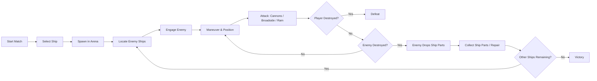
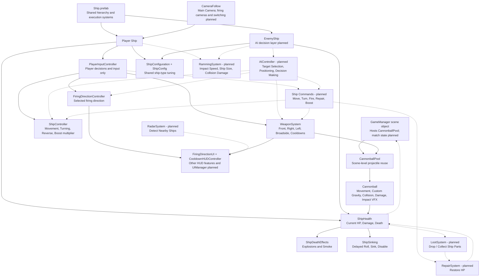

# Pirates of the Mediterranean - GDD

| | |
|---|---|
| **Working title** | Pirates of the Mediterranean |
| **Team** | Roy Tomer |
| **Genre** | 3D Naval Combat / Arcade Action / Free-for-All |
| **Target platform** | PC - Windows and macOS |
| **Engine / Unity version** | Unity 6, URP, 3D |
| **Orientation & reference resolution** | Landscape, 1920 × 1080 |
| **Expected session length** | 5–10 minutes |
| **Document version** | v0.1 - 2026-09-07 |

## 1. High Concept

**Pirates of the Mediterranean** is a 3D single-player naval combat game set in a stylized pirate-era archipelago. The player competes in a free-for-all battle against AI-controlled ships, aiming to become the **Last Ship Standing**. Combat focuses on maneuvering, positioning, directional cannon fire, broadside attacks, ramming, and distinct ship playstyles.

### Design Pillars

- **Positioning-Based Combat** - maneuvering and firing angles are central to winning.
- **Distinct Ships, Simple Controls** - different ship types should feel meaningfully different while remaining easy to control.
- **Dynamic Free-for-All Battles** - AI ships fight both the player and each other, creating unpredictable encounters during each match.

## 2. Core Game Loop

The complete loop below is planned. Movement, cannon combat, HP/damage, and local ship death are implemented; AI battles, loot/repair, and match-level victory/defeat are not yet implemented.

### Moment-to-Moment Rules

- The player continuously moves and steers the ship to create better attack angles.
- PLANNED (not currently implemented): cannons should require the target to be within effective range before firing.
- Each firing side has its own cooldown.
- Broadside attacks reward good side positioning.
- Ramming damage depends on impact speed and ship size.
- Destroyed ships drop Ship Parts.
- Ship Parts can be collected and used to repair the player ship.
- The player must survive until all other ships are destroyed.

### Parameters to Tune

Current shared ship-type tuning in `ShipConfig`:

| Group | Parameter | Current value |
|---|---|---|
| Movement | `acceleration` | 15 |
| Movement | `turnAcceleration` | 2 |
| Movement | `boostMultiplier` | 1.5 |
| Movement | `maxTurnSpeed` | 0.6 |
| Combat | `maxHealth` | 100 |
| Combat | `cooldownDuration` | 2 |
| Combat | `extraCooldownPenalty` | 2 |
| Combat | `cannonballSpeed` | 150 |
| DeathEffects | `explosionDelay` | 1 |
| DeathEffects | `smokeDelay` | 2 |
| Sinking | `sinkingStartDelay` | 8 |
| Sinking | `centerlineThreshold` | 0.5 |
| Sinking | `rollAngle` | 80 |
| Sinking | `rollDuration` | 6 |
| Sinking | `rollDropDistance` | 2 |
| Sinking | `sinkSpeed` | 2 |
| Sinking | `sinkDepth` | 30 |

Projectile tuning remains outside `ShipConfig`; the current Cannonball `damage` value is 10. Future tuning remains planned/TBD and is not assigned to ShipConfig yet:

| Parameter | What it controls | First guess |
|---|---|---|
| `boostDuration` | How long the short boost lasts | TBD |
| `boostCooldown` | How long before the boost can be used again | TBD |
| `cannonRange` | Maximum firing range | TBD |
| `rammingMultiplier` | How strongly speed and ship size affect ramming damage | TBD |
| `repairAmount` | HP restored when using Ship Parts | TBD |
| `repairCost` | Number of Ship Parts required for one repair | TBD |
| `shipPartsDropAmount` | Amount of Ship Parts dropped by destroyed ships | TBD |
| `radarRange` | Distance at which ships appear on the minimap / radar | TBD |

**Where these live:** current shared ship tuning lives in `ShipConfig`, referenced by the root `ShipConfiguration` component. Other configuration remains in serialized fields or future ScriptableObjects so it can be changed from the Unity Inspector without modifying code.

## 3. Controls & Input

The player controls the ship from a third-person perspective.

The `E` camera toggle, `R` repair, and `Left Shift` short boost below are planned controls, not implemented bindings. The shared boost multiplier exists, but boost input, duration, and cooldown remain planned.

| Action                             | Keyboard / Mouse              |
| ---------------------------------- | ----------------------------- |
| Move forward                       | `W`                           |
| Move backward / reverse            | `S`                           |
| Turn left                          | `A`                           |
| Turn right                         | `D`                           |
| Cycle firing direction clockwise   | `Q`                           |
| Toggle Main Camera / Firing Camera | `E`                           |
| Fire selected cannons              | `Left Mouse Button` / `Space` |
| Repair using Ship Parts            | `R`                           |
| Short boost                        | `Left Shift`                  |
| Rotate Main Camera                 | Mouse                         |

The selected firing direction cycles clockwise through:

`Front → Right → Left → Front`

The currently selected firing direction is clearly shown on the HUD.

Planned: if the player changes the firing direction while using the Firing Camera, the camera will automatically switch to the corresponding firing-side view.

### Camera

The design includes two camera modes; only the Main Camera is currently implemented:

* **Main Camera (implemented)** - a custom third-person `CameraFollow` system positioned behind and above the ship. The player can rotate it horizontally using the mouse; it smoothly returns toward the ship heading after inactivity. Cinemachine is not currently used.
* **Firing Camera (planned)** - a fixed combat camera aligned with the currently selected firing direction.

Three firing camera views are planned: Front, Right, and Left.

Planned: pressing `E` will toggle between the Main Camera and the Firing Camera.

Planned: while using the Firing Camera, pressing `Q` will change both the selected firing direction and the active firing camera to the next direction.

## 4. Ships

The game is planned to include different ship classes with distinct strengths and weaknesses. Sloop/Galleon differentiation is not implemented yet; both current ships share one default configuration.

### Sloop

- Fast and agile
- Lower HP
- Faster turning
- Lower overall firepower
- Lower ramming damage

The Sloop is designed for players who prefer mobility, quick repositioning, and avoiding direct prolonged engagements.

### Galleon

- Slower and heavier
- Higher HP
- Slower turning
- Higher overall firepower
- Higher ramming damage

The Galleon is designed for players who prefer durability, powerful attacks, and direct confrontations.

## 5. Combat Mechanics

Combat is based on maneuvering the ship into effective positions and choosing the correct attack direction.

### Cannons

- Ships can fire cannons in three directions: Front, Right, and Left.
  - Front: 2 cannons
  - Left: 4 cannons
  - Right: 4 cannons
- Side cannons are used for powerful broadside attacks.
- Target/range-based firing restriction is PLANNED and not currently implemented. The intended design requires a target within effective range; currently, a living ship can fire whenever the selected direction is ready, regardless of whether a target is detected or within range.
- Cannons use a reload / cooldown system rather than limited ammunition.
- Front, Left, and Right have separate cooldown timers, with a base cooldown of 2 seconds per direction.
- Firing a ready direction while one or more other directions are cooling down adds a 2-second penalty to the newly fired direction's base cooldown and to each other active cooldown. Directions with no active cooldown receive no penalty unless they are the direction being fired.

### Ramming

Planned; collision-based ramming damage is not implemented yet.

- Ships can damage enemies by colliding with them.
- Ramming damage is affected by the ship's size and impact speed.
- Larger ships are generally more effective at ramming.

### Damage and Destruction

- Each ship has HP.
- Taking damage reduces HP.
- When HP reaches zero, the ship can no longer move or fire, and the lethal hit position is recorded.
- A three-point death sequence uses Bow, Middle, and Stern explosion points. The point nearest the lethal hit determines the order:
  - Bow hit: Bow → Middle → Stern
  - Middle hit: Middle → Bow → Stern
  - Stern hit: Stern → Middle → Bow
- Explosions are 1 second apart; smoke appears independently 2 seconds after each explosion.
- Sinking begins 8 seconds after death. The ship rolls toward the side determined by the lethal hit; centerline hits may choose either side.
- The ship rolls 80 degrees over 6 seconds and drops 2 units during the roll.
- It then sinks downward at 2 units/second to a total depth of 30 units below its original death position, and is disabled after the sequence.

Local ship death/destruction is implemented. Match-level elimination tracking and Last Ship Standing victory/defeat handling remain planned.

### Repair

Planned; Ship Parts drops, loot collection, and repair are not implemented yet.

- Destroyed ships drop Ship Parts.
- The player can collect Ship Parts and use them to restore part of the ship's HP during the match.

## 6. AI Behavior

Planned; `AIController` and AI free-for-all behavior are not implemented yet.

AI-controlled ships participate in the same free-for-all battle as the player and can attack both the player and other AI ships.

The AI should be able to:

- Detect nearby enemy ships.
- Select and switch targets when needed.
- Navigate toward enemies.
- Maneuver into suitable firing positions.
- Attack when the target is within range.
- Reposition during combat instead of continuously moving directly toward the target.
- Continue participating in the battle without always prioritizing the player.

The goal is for AI ships to behave as active competitors in the arena, creating dynamic battles where different ships engage each other throughout the match.

## 7. Map & Arena

The complete arena layout below is planned; the current GameScene contains the ocean combat setup.

The match takes place in a single naval arena with a large open-water combat area in the center.

One side of the map is defined by a long archipelago or coastline, while the other sides are enclosed by smaller islands and rock formations. This creates a natural boundary for the arena without relying on visible artificial walls.

The layout is designed to leave enough open space for maneuvering, broadside attacks, and ramming, while still allowing occasional opportunities for cover and repositioning.

### Map Concept

The concept sketch shows the intended arena layout: open water in the center, a larger landmass on one side, and smaller islands and rocks enclosing the rest of the battlefield.

## 8. HUD & UI

The in-game HUD should display only the essential information needed during combat.

The HUD should include:

Currently, selected firing direction and cooldown status are implemented. HP, Ship Parts, minimap/radar, and ships remaining are planned.

- **Ship HP**
- **Current amount of Ship Parts**
- **Selected firing direction**
- **Cooldown status for each firing side**
- **Minimap / Radar**
- **Number of ships remaining**

The interface should remain clear and minimal so that it does not obstruct the player's view during combat.

### Screens

The Gameplay Screen has the current combat view and partial HUD. Main Menu, Choose Loadout, Game Over, Victory, and their navigation flows remain planned.

The game should include the following main screens:

- **Main Menu**
- **Choose Loadout**
- **Gameplay Screen**
- **Game Over Screen**
- **Victory Screen**

The Main Menu allows the player to start a new match.

The Choose Loadout screen allows the player to select the ship type before entering the arena.

The Gameplay Screen contains the in-game HUD and the main combat view.

The Game Over and Victory screens display the result of the match and allow the player to restart or return to the menu.

## 9. Technical Design

The game is divided into several main systems, each responsible for a specific part of the gameplay.

### Scenes

* `MainMenu` (planned) - contains the main menu and allows the player to start a new match.
* `Loadout` (planned) - allows the player to choose the ship type before entering the match.
* `GameScene` (current) - contains the ocean combat setup, PlayerShip, EnemyShip, combat systems, and partial HUD. AI behavior and match logic remain planned.

Victory and Game Over are planned as UI states inside `GameScene` rather than separate scenes.

### Packages / Systems Used

* **URP**
* **Unity Input System**
* **Unity Physics**
* **Custom CameraFollow**

### Target Device

PC - Windows and macOS.

### Architecture

Solid connections show current relationships; dashed connections show planned integrations. Match-state behavior on GameManager remains planned.

Both PlayerShip and EnemyShip derive from one common `Ship.prefab`. It contains the shared visual hierarchy, Rigidbody, buoyancy, hit colliders, fire points, death points, and shared execution systems: `ShipController`, `WeaponSystem`, `ShipHealth`, `FiringDirectionController`, `ShipDeathEffects`, and `ShipSinking`.

`PlayerInputController` exists only on PlayerShip as a scene override and handles player decisions/input. It currently calls shared components directly. Future `AIController` will be a separate decision layer calling the same execution systems, not a separate implementation of movement or combat. Command objects are not implemented yet.

`ShipConfig` is a ScriptableObject containing shared ship-type tuning in Movement, Combat, DeathEffects, and Sinking groups. `ShipConfiguration` is a root component on `Ship.prefab` holding one reference to the config. Both current ships inherit the same default config; one config per ship type is the intended setup. Current health, cooldown timers, death state, and sinking state remain per ship instance.

Rigidbody, buoyancy, transforms, colliders, fire/death points, effect references, camera, HUD, and projectile prefab configuration remain outside `ShipConfig`.

The current projectile path is `WeaponSystem → CannonballPool → Cannonball`. CannonballPool is a scene-level service on GameManager; both scene WeaponSystems reference that shared pool. Cannonballs handle movement, custom gravity, collision/damage, impact VFX, and returning to the pool. VFX are currently instantiated, not pooled.

### Main Systems

| System              | Responsibility                                                                                                                                   |
| ------------------- | ------------------------------------------------------------------------------------------------------------------------------------------------ |
| `GameManager` | Currently a scene object hosting CannonballPool. Match state, start, victory, defeat, ships remaining, and singleton behavior are planned. |
| `PlayerInputController` | Reads keyboard and mouse input and directly calls shared execution systems; player decisions/input only. |
| `Ship Commands` | PLANNED: may encapsulate shared movement, turning, firing direction selection, firing, repair, and boost. No command objects currently exist. |
| `CameraController` | PLANNED: three firing camera views (Front, Right, Left) and switching. Current CameraFollow provides the main third-person camera. |
| `ShipController` | Handles ship movement, turning, reverse movement, and the boost multiplier. Short-boost input, duration, and cooldown remain planned. |
| `ShipConfig / ShipConfiguration` | ShipConfig stores shared ship-type tuning; root ShipConfiguration holds the config reference. Runtime state remains per instance. |
| `WeaponSystem` | Handles Front, Right, and Left firing, broadside attacks, and cooldown timers with the additional cooldown penalty. |
| `CannonballPool` | CannonballPool is a shared scene-level service on GameManager that spawns and reuses cannonballs. |
| `Cannonball` | Handles movement, custom gravity, collision/damage, impact VFX, and returning to the pool. |
| `ShipHealth` | Tracks current HP, damage, death state, and the lethal hit position; raises OnDeath. Visual death effects and sinking are separate components. |
| `RammingSystem` | PLANNED: calculates collision damage based on impact speed and ship size. |
| `LootSystem` | PLANNED: handles Ship Parts drops and collection. |
| `RepairSystem` | PLANNED: uses collected Ship Parts to restore HP. |
| `AIController` | PLANNED: selects targets, positions the ship, and makes decisions by calling the same shared execution systems as player input. |
| `RadarSystem` | PLANNED: detects nearby ships and provides information for the minimap. |
| `UIManager` | PLANNED: full HUD management. Current FiringDirectionUI and CooldownHUDController display direction and cooldowns; HP, Ship Parts, radar, and ships remaining are planned. |
| `VFX Pool (optional/planned)` | Cannonball pooling is implemented by CannonballPool. VFX pooling remains optional/planned; effects are currently instantiated. |

### Course Features / Design Patterns

1. **Singleton — PLANNED** - a central match-state GameManager/singleton is not implemented. The current GameManager scene object hosts CannonballPool.

2. **Object Pool — IMPLEMENTED for cannonballs** - CannonballPool reuses cannonballs. VFX are currently instantiated; VFX pooling remains optional/planned.

3. **Coroutines — IMPLEMENTED** - used for timed death explosions and smoke. WeaponSystem cooldowns use timer updates, not coroutines. ShipSinking uses a FixedUpdate-driven state machine.

4. **Command Pattern — PLANNED** - command objects are not implemented yet. They may later encapsulate shared actions for both the player and AI.

Currently, PlayerInputController decides what the player wants to do and directly calls shared execution systems. Future AIController will decide what AI wants to do and call those same systems.

Planned command examples include movement, turning, firing direction selection, firing, repairing, and boosting.

This ensures that player-controlled and AI-controlled ships use the same gameplay logic instead of maintaining separate implementations.

---

## 10. Scope

### 10.1 MVP - Must Have

- [ ] Sloop
- [ ] Galleon
- [x] Ship movement
- [x] Main third-person camera
- [ ] Three firing camera views: Front, Right, Left, and camera toggle
- [x] Cannons in three directions: Front, Right, Left
- [x] Broadside attacks
- [ ] Ramming
- [x] HP, damage, and local ship destruction
- [ ] AI ships participating in the Free For All
- [ ] Ship Parts drops and repair
- [x] Selected firing direction and cooldown HUD
- [ ] Remaining HUD: HP, Ship Parts, minimap/radar, and ships remaining
- [ ] Minimap / Radar
- [ ] One complete arena
- [ ] Victory and defeat flow
- [x] Hit VFX
- [x] Short smoke effect at impact points
- [x] Basic ship destruction effect: explosions, smoke, and sinking
- [ ] Main Menu and Loadout

### 10.2 Nice to Have / Polish

- [ ] Third ship class
- [ ] Mortar
- [ ] Explosive barrels
- [ ] Other special weapons
- [ ] Captain animation
- [ ] Advanced radar behavior
- [ ] Better water interaction and ship rocking
- [ ] Ship breaking into separate pieces
- [ ] Multiple visual damage stages
- [ ] More advanced fire and destruction effects

### 10.3 Explicitly Out of Scope

- Boarding
- Third-person character combat
- Open world
- Campaign
- Multiplayer
- Full crew system
- Shop or long-term progression

## 11. Art & Assets

The game will use a stylized / semi-realistic pirate visual style.

### Ship Asset

**Stylized Pirate Ship by Yorakeys**  
https://www.cgtrader.com/3d-models/vehicle/other/stylized-pirate-ship-by-yorakeys

This asset will serve as the base ship model. Small modifications such as scale, colors, materials, weapon placement, and other visual changes will be used to create the different ship types, including the Sloop and Galleon.

The asset also includes modular parts and weapons such as cannons, mortar, ram, armor, barrels, and other props.

### Water Asset

**RenderWave – Scalable Ocean System**  
https://assetstore.unity.com/packages/tools/particles-effects/renderwave-scalable-ocean-system-370516

Used for the ocean surface, waves, foam, ship wake, and basic ship-water interaction.

### Environment Asset

**Realistic Beachfront Nature Island 3 Asset Package**  
https://www.fab.com/listings/cfa395d8-bb55-48e3-bdd3-523a7abe5bcc

Used to create the islands, coastline, rocks, sand, and vegetation surrounding the arena.