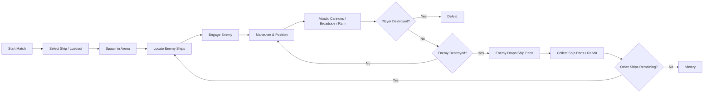

# Pirates of the Mediterranean - GDD

## 1. High Concept

**Pirates of the Mediterranean** is a 3D single-player naval combat game set in a stylized pirate-era archipelago.

The player controls a pirate ship in a free-for-all battle against AI-controlled ships, where every ship can fight any other ship. The goal is to survive and become the **Last Ship Standing**.

Combat focuses on maneuvering, positioning, cannon fire from multiple directions, broadside attacks, and ramming. Different ship types offer different playstyles, such as the fast and agile Sloop and the slower, more powerful Galleon.

### Design Pillars

- **Positioning-Based Combat** - effective maneuvering and firing angles are key to winning.
- **Simple Controls, Meaningful Decisions** - easy to learn, with tactical choices during combat.
- **Distinct Ship Playstyles** - different ships should feel and play differently.
- **Dynamic Free-for-All Battles** - AI ships fight both the player and each other.
- **Pirate Fantasy Over Simulation** - fun and readability take priority over historical accuracy.

## 2. Core Game Loop

## 3. Controls & Input

The player controls the ship from a third-person perspective.

### Movement

- Move forward
- Move backward / reverse
- Turn left
- Turn right
- Short boost

### Combat

- Fire left-side cannons
- Fire right-side cannons
- Fire front cannons
- Fire rear cannons

### Other Actions

- Repair ship using collected Ship Parts

### Camera

- Third-person camera positioned behind and above the ship
- The camera can rotate around the ship independently from the ship's movement

## 4. Ships

The game includes different ship classes with distinct strengths and weaknesses.

### Sloop

- Fast and agile
- Lower HP
- Faster turning
- Lower overall firepower
- Lower ramming damage

The Sloop is designed for players who prefer mobility, quick repositioning, and avoiding direct prolonged engagements.

### Galleon

- Slower and heavier
- Higher HP
- Slower turning
- Higher overall firepower
- Higher ramming damage

The Galleon is designed for players who prefer durability, powerful attacks, and direct confrontations.

### Nice to Have

A third ship class may be added later, focused on aggressive close-range combat and tactical abilities.

This ship could feature stronger ramming capabilities, deployable explosive barrels, additional special weapons, and a reduced number of cannons.

## 5. Combat Mechanics

Combat is based on maneuvering the ship into effective positions and choosing the correct attack direction.

### Cannons

- Ships can fire cannons from the left, right, front, and rear.
- Side cannons are used for powerful broadside attacks.
- Cannons have a limited firing range, requiring the player to get within effective distance before attacking.
- Cannons use a reload / cooldown system rather than limited ammunition.

### Ramming

- Ships can damage enemies by colliding with them.
- Ramming damage is affected by the ship's size and impact speed.
- Larger ships are generally more effective at ramming.

### Damage and Destruction

- Each ship has HP.
- Taking damage reduces HP.
- When HP reaches zero, the ship is destroyed and removed from the match.

### Repair

- Destroyed ships drop Ship Parts.
- The player can collect Ship Parts and use them to restore part of the ship's HP during the match.

### Nice to Have

- Mortar weapon
- Explosive barrels
- Other special weapons

## 6. AI Behavior

AI-controlled ships participate in the same free-for-all battle as the player and can attack both the player and other AI ships.

The AI should be able to:

- Detect nearby enemy ships.
- Select and switch targets when needed.
- Navigate toward enemies.
- Maneuver into suitable firing positions.
- Attack when the target is within range.
- Reposition during combat instead of continuously moving directly toward the target.
- Continue participating in the battle without always prioritizing the player.

The goal is for AI ships to behave as active competitors in the arena, creating dynamic battles where different ships engage each other throughout the match.

## 7. Map & Arena

The match takes place in a single naval arena with a large open-water combat area in the center.

One side of the map is defined by a long archipelago or coastline, while the other sides are enclosed by smaller islands and rock formations. This creates a natural boundary for the arena without relying on visible artificial walls.

The layout is designed to leave enough open space for maneuvering, broadside attacks, and ramming, while still allowing occasional opportunities for cover and repositioning.

### Map Concept

The concept sketch shows the intended arena layout: open water in the center, a larger landmass on one side, and smaller islands and rocks enclosing the rest of the battlefield.

## 8. HUD & UI

The in-game HUD should display only the essential information needed during combat.

The HUD should include:

- **Ship HP**
- **Current amount of Ship Parts**
- **Selected firing direction**
- **Cooldown status for each firing side**
- **Minimap / Radar**
- **Number of ships remaining**

The interface should remain clear and minimal so that it does not obstruct the player's view during combat.

### Screens

The game should include the following main screens:

- **Main Menu**
- **Choose Loadout**
- **Gameplay Screen**
- **Game Over Screen**
- **Victory Screen**

The Main Menu allows the player to start a new match.

The Choose Loadout screen allows the player to select the ship and available equipment before entering the arena.

The Gameplay Screen contains the in-game HUD and the main combat view.

The Game Over and Victory screens display the result of the match and allow the player to restart or return to the menu.