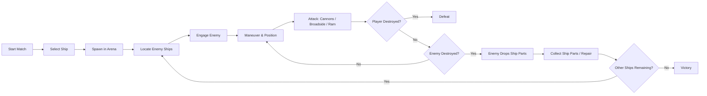
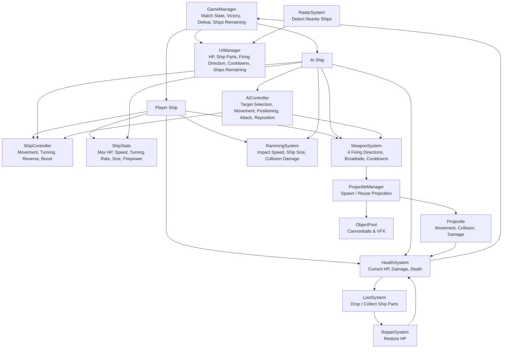

# Pirates of the Mediterranean - GDD

| | |
|---|---|
| **Working title** | Pirates of the Mediterranean |
| **Team** | Roy Tomer |
| **Genre** | 3D Naval Combat / Arcade Action / Free-for-All |
| **Target platform** | PC - Windows and macOS |
| **Engine / Unity version** | Unity 6, URP, 3D |
| **Orientation & reference resolution** | Landscape, 1920 × 1080 |
| **Expected session length** | 5–10 minutes |
| **Document version** | v0.1 - 2026-09-07 |

## 1. High Concept

**Pirates of the Mediterranean** is a 3D single-player naval combat game set in a stylized pirate-era archipelago. The player competes in a free-for-all battle against AI-controlled ships, aiming to become the **Last Ship Standing**. Combat focuses on maneuvering, positioning, directional cannon fire, broadside attacks, ramming, and distinct ship playstyles.

### Design Pillars

- **Positioning-Based Combat** - maneuvering and firing angles are central to winning.
- **Distinct Ships, Simple Controls** - different ship types should feel meaningfully different while remaining easy to control.
- **Dynamic Free-for-All Battles** - AI ships fight both the player and each other, creating unpredictable encounters during each match.

## 2. Core Game Loop

### Moment-to-Moment Rules

- The player continuously moves and steers the ship to create better attack angles.
- Cannons can only be fired when the target is within range.
- Each firing side has its own cooldown.
- Broadside attacks reward good side positioning.
- Ramming damage depends on impact speed and ship size.
- Destroyed ships drop Ship Parts.
- Ship Parts can be collected and used to repair the player ship.
- The player must survive until all other ships are destroyed.

### Parameters to Tune

| Parameter | What it controls | First guess |
|---|---|---|
| `shipSpeed` | Base movement speed of each ship type | TBD |
| `turnSpeed` | How quickly each ship can rotate | TBD |
| `boostStrength` | Strength of the short speed boost | TBD |
| `boostDuration` | How long the short boost lasts | TBD |
| `boostCooldown` | How long before the boost can be used again | TBD |
| `maxHP` | Maximum health of each ship type | TBD |
| `cannonDamage` | Damage dealt by a cannon hit | TBD |
| `cannonRange` | Maximum firing range | TBD |
| `reloadTime` | Cooldown before a firing side can shoot again | TBD |
| `rammingMultiplier` | How strongly speed and ship size affect ramming damage | TBD |
| `repairAmount` | HP restored when using Ship Parts | TBD |
| `repairCost` | Number of Ship Parts required for one repair | TBD |
| `shipPartsDropAmount` | Amount of Ship Parts dropped by destroyed ships | TBD |
| `radarRange` | Distance at which ships appear on the minimap / radar | TBD |

**Where these live:** serialized fields or ScriptableObjects so they can be changed from the Unity Inspector without modifying code.

## 3. Controls & Input

The player controls the ship from a third-person perspective.

| Action | Keyboard / Mouse |
|---|---|
| Move forward | `W` |
| Move backward / reverse | `S` |
| Turn left | `A` |
| Turn right | `D` |
| Select left firing direction | `Left Arrow` |
| Select right firing direction | `Right Arrow` |
| Select front firing direction | `Up Arrow` |
| Select rear firing direction | `Down Arrow` |
| Fire selected cannons | `Space` |
| Repair using Ship Parts | `R` |
| Short boost | `Left Shift` |
| Rotate camera | Mouse |

The selected firing direction is shown on the HUD before the player fires.

### Camera

- Third-person camera positioned behind and above the ship.
- The camera can rotate around the ship independently from the ship's movement.

## 4. Ships

The game includes different ship classes with distinct strengths and weaknesses.

### Sloop

- Fast and agile
- Lower HP
- Faster turning
- Lower overall firepower
- Lower ramming damage

The Sloop is designed for players who prefer mobility, quick repositioning, and avoiding direct prolonged engagements.

### Galleon

- Slower and heavier
- Higher HP
- Slower turning
- Higher overall firepower
- Higher ramming damage

The Galleon is designed for players who prefer durability, powerful attacks, and direct confrontations.

## 5. Combat Mechanics

Combat is based on maneuvering the ship into effective positions and choosing the correct attack direction.

### Cannons

- Ships can fire cannons from the left, right, front, and rear.
- Side cannons are used for powerful broadside attacks.
- Cannons have a limited firing range, requiring the player to get within effective distance before attacking.
- Cannons use a reload / cooldown system rather than limited ammunition.

### Ramming

- Ships can damage enemies by colliding with them.
- Ramming damage is affected by the ship's size and impact speed.
- Larger ships are generally more effective at ramming.

### Damage and Destruction

- Each ship has HP.
- Taking damage reduces HP.
- When HP reaches zero, the ship is destroyed and removed from the match.

### Repair

- Destroyed ships drop Ship Parts.
- The player can collect Ship Parts and use them to restore part of the ship's HP during the match.

## 6. AI Behavior

AI-controlled ships participate in the same free-for-all battle as the player and can attack both the player and other AI ships.

The AI should be able to:

- Detect nearby enemy ships.
- Select and switch targets when needed.
- Navigate toward enemies.
- Maneuver into suitable firing positions.
- Attack when the target is within range.
- Reposition during combat instead of continuously moving directly toward the target.
- Continue participating in the battle without always prioritizing the player.

The goal is for AI ships to behave as active competitors in the arena, creating dynamic battles where different ships engage each other throughout the match.

## 7. Map & Arena

The match takes place in a single naval arena with a large open-water combat area in the center.

One side of the map is defined by a long archipelago or coastline, while the other sides are enclosed by smaller islands and rock formations. This creates a natural boundary for the arena without relying on visible artificial walls.

The layout is designed to leave enough open space for maneuvering, broadside attacks, and ramming, while still allowing occasional opportunities for cover and repositioning.

### Map Concept

The concept sketch shows the intended arena layout: open water in the center, a larger landmass on one side, and smaller islands and rocks enclosing the rest of the battlefield.

## 8. HUD & UI

The in-game HUD should display only the essential information needed during combat.

The HUD should include:

- **Ship HP**
- **Current amount of Ship Parts**
- **Selected firing direction**
- **Cooldown status for each firing side**
- **Minimap / Radar**
- **Number of ships remaining**

The interface should remain clear and minimal so that it does not obstruct the player's view during combat.

### Screens

The game should include the following main screens:

- **Main Menu**
- **Choose Loadout**
- **Gameplay Screen**
- **Game Over Screen**
- **Victory Screen**

The Main Menu allows the player to start a new match.

The Choose Loadout screen allows the player to select the ship type before entering the arena.

The Gameplay Screen contains the in-game HUD and the main combat view.

The Game Over and Victory screens display the result of the match and allow the player to restart or return to the menu.

## 9. Technical Design

The game is divided into several main systems, each responsible for a specific part of the gameplay.

### Scenes

- `MainMenu` - contains the main menu and allows the player to start a new match.
- `Loadout` - allows the player to choose the ship type before entering the match.
- `Game` - contains the naval arena, player ship, AI ships, combat systems, HUD, and match logic.

Victory and Game Over are handled as UI states inside the `Game` scene rather than separate scenes.

### Packages / Systems Used

- **URP**
- **Unity Input System**
- **Unity Physics**
- **Cinemachine**

### Target Device

PC - Windows and macOS.

### Architecture

### Main Systems

| System | Responsibility |
|---|---|
| `GameManager` | Manages the overall match state, including start, victory, defeat, and the number of ships remaining. |
| `ShipController` | Handles ship movement, turning, reverse movement, and boost. |
| `ShipStats` | Stores ship-specific base values such as maximum HP, speed, turn rate, size, and firepower. |
| `WeaponSystem` | Handles firing from the four directions, broadside attacks, and weapon cooldowns. |
| `ProjectileManager` | Spawns and reuses projectiles through the Object Pool. |
| `Projectile` | Handles projectile movement, collision detection, and applying damage on impact. |
| `HealthSystem` | Tracks current HP and handles damage and ship destruction. |
| `RammingSystem` | Calculates collision damage based on impact speed and ship size. |
| `LootSystem` | Handles Ship Parts drops and collection. |
| `RepairSystem` | Uses collected Ship Parts to restore HP. |
| `AIController` | Controls target selection, movement, positioning, attacking, and repositioning for AI ships. |
| `RadarSystem` | Detects nearby ships and provides information for the minimap. |
| `UIManager` | Updates the HUD with HP, Ship Parts, selected firing direction, cooldowns, and remaining ships. |
| `ObjectPool` | Reuses cannonballs and possibly VFX instead of repeatedly creating and destroying them. |

### Course Features / Design Patterns

1. **Singleton** - used for the `GameManager` so there is one central manager controlling the match state.

2. **Object Pool** - used for cannonballs and possibly combat VFX to avoid repeated `Instantiate` / `Destroy` operations during gameplay.

3. **Coroutines** - used for timed gameplay actions such as reloads, cooldowns, and temporary effects.

---

## 10. Scope

### 10.1 MVP - Must Have

- [ ] Sloop
- [ ] Galleon
- [ ] Ship movement
- [ ] Third-person camera
- [ ] Cannons in four directions
- [ ] Broadside attacks
- [ ] Ramming
- [ ] HP, damage, and ship destruction
- [ ] AI ships participating in the Free For All
- [ ] Ship Parts drops and repair
- [ ] HUD
- [ ] Minimap / Radar
- [ ] One complete arena
- [ ] Victory and defeat flow
- [ ] Hit VFX
- [ ] Short smoke effect at impact points
- [ ] Basic ship destruction effect such as explosion, smoke, or sinking

### 10.2 Nice to Have / Polish

- [ ] Third ship class
- [ ] Mortar
- [ ] Explosive barrels
- [ ] Other special weapons
- [ ] Captain animation
- [ ] Advanced radar behavior
- [ ] Better water interaction and ship rocking
- [ ] Ship breaking into separate pieces
- [ ] Multiple visual damage stages
- [ ] More advanced fire and destruction effects

### 10.3 Explicitly Out of Scope

- Boarding
- Third-person character combat
- Open world
- Campaign
- Multiplayer
- Full crew system
- Shop or long-term progression

## 11. Art & Assets

The game will use a stylized / semi-realistic pirate visual style.

### Ship Asset

**Stylized Pirate Ship by Yorakeys**  
https://www.cgtrader.com/3d-models/vehicle/other/stylized-pirate-ship-by-yorakeys

This asset will serve as the base ship model. Small modifications such as scale, colors, materials, weapon placement, and other visual changes will be used to create the different ship types, including the Sloop and Galleon.

The asset also includes modular parts and weapons such as cannons, mortar, ram, armor, barrels, and other props.

### Water Asset

**RenderWave – Scalable Ocean System**  
https://assetstore.unity.com/packages/tools/particles-effects/renderwave-scalable-ocean-system-370516

Used for the ocean surface, waves, foam, ship wake, and basic ship-water interaction.

### Environment Asset

**Realistic Beachfront Nature Island 3 Asset Package**  
https://www.fab.com/listings/cfa395d8-bb55-48e3-bdd3-523a7abe5bcc

Used to create the islands, coastline, rocks, sand, and vegetation surrounding the arena.