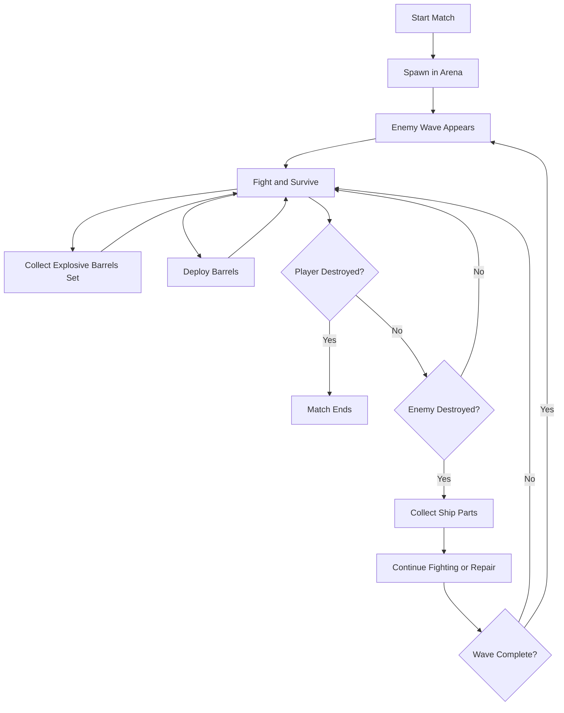
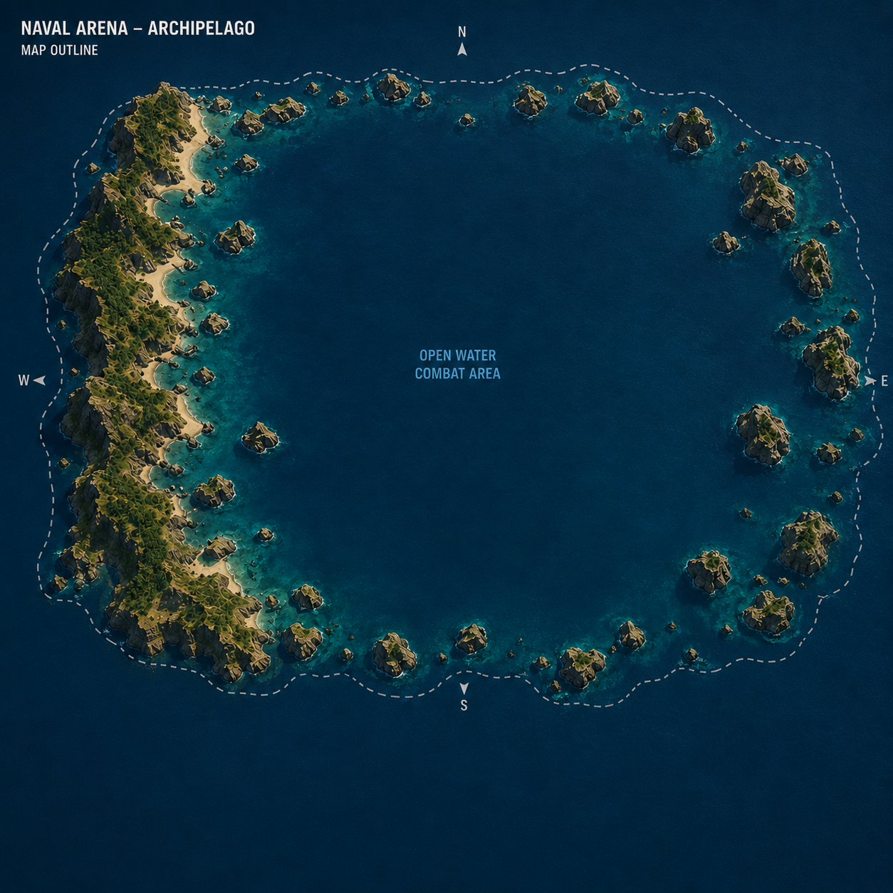
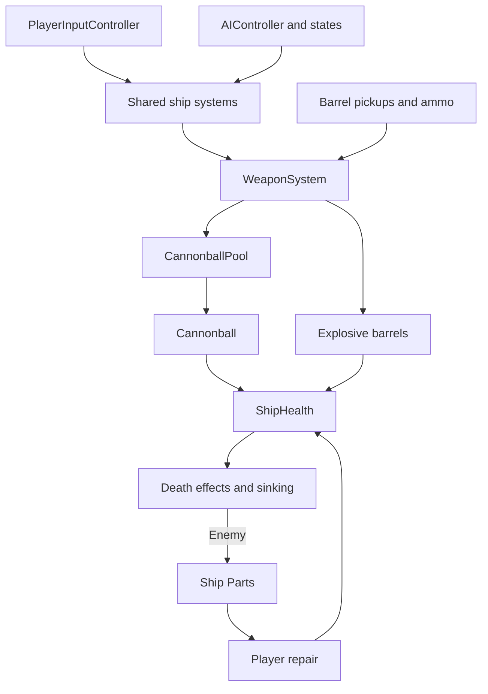

# Pirates of the Mediterranean - GDD

| | |
|---|---|
| **Working title** | Pirates of the Mediterranean |
| **Team** | Roy Tomer |
| **Genre** | 3D Naval Combat / Arcade Survival |
| **Target platform** | PC - Windows and macOS |
| **Engine / Unity version** | Unity 6, URP, 3D |
| **Orientation & reference resolution** | Landscape, 1920 × 1080 |
| **Expected session length** | TBD — survival-based |
| **Document version** | v0.3 - 2026-09-25 |

## 1. High Concept

**Pirates of the Mediterranean** is a 3D single-player naval combat game set in a stylized pirate-era archipelago. The player fights successive waves of AI-controlled enemy ships, aiming to survive for as long as possible. Combat focuses on maneuvering, positioning, directional cannon fire, broadside attacks, ramming, and collecting resources such as Ship Parts and Explosive Barrels Sets.

### Design Pillars

- **Positioning-Based Combat** - maneuvering and firing angles are central to survival.
- **Simple Controls, Tactical Choices** - the ship remains easy to control while combat and resources give the player meaningful choices.
- **Escalating Survival** - successive waves of enemy ships increase the pressure on the player and reward sustained combat and resource management.

## 2. Core Game Loop

The match loop is survival against successive waves of enemy ships. The player fights, collects Ship Parts from defeated enemies to repair the ship, and collects Explosive Barrels Sets that appear in the arena to deploy in combat while trying to survive for as long as possible.

Ship movement, cannon combat, HP/damage, ship death, AI combat, Ship Parts loot and repair, and Explosive Barrels Set pickups and deployment are implemented. Wave spawning, match-level defeat, survival results, and restart are implemented; combat balance and HUD polish still require gameplay review.

```mermaid
flowchart TD
    A["Start Match"] --> C["Spawn in Arena"]
    C --> D["Enemy Wave Appears"]
    D --> E["Fight and Survive"]
    E --> L["Collect Explosive Barrels Set"]
    L --> E
    E --> M["Deploy Barrels"]
    M --> E
    E --> F{"Player Destroyed?"}
    F -- Yes --> G["Match Ends"]
    F -- No --> H{"Enemy Destroyed?"}
    H -- Yes --> I["Collect Ship Parts"]
    H -- No --> E
    I --> J["Continue Fighting or Repair"]
    J --> K{"Wave Complete?"}
    K -- No --> E
    K -- Yes --> D
```

### Approved Survival Rules (2026-09-28)

These rules are implemented in `GameManager`, including the starting barrel-set rolls for wave enemies.

- Survive successive enemy waves until the player is destroyed.
- Start the player at a random point from the shared set of 13 spawn points, with full health, 0 Ship Parts, and 0 Explosive Barrels Sets. The first wave starts after 5 seconds.
- Wave 1 has 1 enemy; waves 2–3 have 2 enemies; waves 4–6 have 3 enemies; wave 7 onward has 4 enemies.
- All enemies in a wave spawn together at distinct, unoccupied points. Select points without replacement within each wave: never assign the same point to two enemies.
- Enemy spawn points must be at least 300 world units from the player's current position, measured horizontally. `GameManager.minimumEnemySpawnDistance` is a serialized Inspector setting with a default of 300. Existing ships must also have enough clearance to avoid overlapping newly spawned ships.
- If there are too few eligible points, retry once per second without bypassing distance, occupancy, or uniqueness constraints. Spawn the entire wave together only when a complete group of points is available.
- A wave ends when all its enemies reach 0 HP; sinking completion is not required.
- Allow 10 seconds between waves for collection and repair, with a visible countdown.
- Player health and inventory carry over between waves; the player receives no automatic healing.
- Starting at wave 1, each enemy independently rolls in order: 20% for 4 sets; on failure, 40% for 3; on failure, 60% for 2; on failure, 80% for 1; otherwise 0. Stop on the first success. Final probabilities are 20%, 32%, 28.8%, 15.36%, and 3.84% for 4/3/2/1/0 sets. Each set deploys four barrels. The start wave and conditional percentages are serialized GameManager settings; these chances stay the same in subsequent waves.
- Results show completed waves, enemies destroyed, and survival time.
- Restart returns to wave 1 with full player health and inventory restored from the PlayerShip Variant component settings. `ResetInventory()` reads `PlayerShipParts.shipParts` and `BarrelAmmo.startingAmmo`; the intended defaults are 0, but Inspector values can be changed for testing and balancing. Runtime collection and spending do not modify these starting settings.

`GameManager` instantiates `Assets/Prefabs/EnemyShip Variant.prefab`, which inherits from `Ship.prefab`. Each instance is created below an inactive staging parent and receives the player target, patrol points root, shared cannonball pool, and HUD player reference before activation and Awake. Its Start then chooses the nearest patrol point. Both fixed ship instances have been removed from GameScene. GameManager creates the player from `PlayerShip Variant.prefab` at match initialization. `PlayerSceneBindings` assigns camera follow, all four firing/rear cameras, input camera control, audio, health/cooldown/direction HUD, inventory text, and the KWS wake simulation target before player activation. The cannonball pool is also assigned before activation. Player spawn height defaults to -5. This player-prefab migration passed compilation and Edit Mode reference checks; gameplay verification is pending with the user, and no Play Mode check was performed for it. Before each enemy is activated, GameManager overrides that instance's starting barrel inventory with the wave roll; the prefab asset and player starting inventory are unchanged. Enemy spawn height is Inspector-configurable (default -5), while spawn points supply X/Z position and yaw. `shipSpawnClearance` defaults to 150 world units between ship centers, including active sinking ships and other selected points. Finished, deactivated enemy clones are destroyed after sinking and loot creation.

Earlier runtime smoke checks passed for waves 1–4 under the previous enemy-count schedule, distinct and separated spawn positions, 300-unit player clearance, 10-second intermissions, the four-enemy cap, atomic failure when no points qualify, Game Over timer freeze, and scene-reload restart with empty player inventory. The revised enemy-count schedule has not been tested in Play Mode. Full combat balancing and visual HUD acceptance remain manual checks.

### Moment-to-Moment Rules

- The player moves and steers the ship to create better attack angles and avoid damage.
- Cannons fire in the selected direction, subject to that firing side's cooldown.
- The AI checks range and angle before firing. A general firing-range limit for the player's cannons is planned but not yet implemented.
- Broadside attacks reward good side positioning.
- Ramming damage currently depends on collision closing speed; ship size is not part of the implemented damage calculation.
- Defeated enemy ships drop Ship Parts that the player can collect.
- The player can spend collected Ship Parts to repair the ship.
- The player can collect Explosive Barrels Sets and deploy a group of four barrels in combat.
- The player survives successive enemy waves until the player ship is destroyed.

### Parameters to Tune

Current values from the ship configuration and connected assets:

| Group | Parameter | Current value |
|---|---|---:|
| Movement | `acceleration` | 20 |
| Movement | `brakeAcceleration` | 3 |
| Movement | `lateralDrag` | 8 |
| Movement | `turnAcceleration` | 1.25 |
| Movement | `maxTurnSpeed` | 0.4 |
| Movement | `fullSteeringSpeed` | 20 |
| Combat | `maxHealth` | 100 |
| Combat | `cooldownDuration` | 4 |
| Combat | `extraCooldownPenalty` | 2 |
| Combat | `cannonballSpeed` | 200 |
| Projectile | Cannonball `damage` | 5 |

Death and sinking effects have their own settings. The current sequence uses explosions followed by a slow roll, a faster capsize, and sinking. The old `sinkingStartDelay` value of 8 seconds is a fallback when death effects do not start the sinking sequence; `rollDuration` is a legacy value and does not describe the current roll sequence.

Additional values and open design decisions:

| Parameter | What it controls | Value |
|---|---|---|
| Player cannon range | Whether and when the player's cannon fire is range-limited | TBD |
| Enemy wave size and progression | Enemies per wave; delay after clearing a wave | Wave 1: 1; waves 2–3: 2; waves 4–6: 3; wave 7+: 4; 10 seconds |
| Minimum enemy spawn distance | Horizontal distance from the player; Inspector configurable | 300 |
| Ship Parts drop amount | Parts awarded per defeated enemy | 1 |
| Repair cost and amount | Parts spent and HP restored per repair | 1 Part; up to 25% of maximum HP |
| Explosive Barrels Set spawning | When pickups appear and maximum active pickups | Initial pickup, then 17% every 30 seconds; maximum 2 active |
| Radar range (optional) | Whether a future radar mode limits which enemies appear | TBD |

**Where these live:** shared ship tuning is stored in `ShipConfig` and referenced by `ShipConfiguration`. Projectile, death-effect, and AI settings are configured separately. Ship Parts, repair, and barrel values are configured in their respective components. Wave delays, spawn clearance, and scene references are configured in `GameManager`.

## 3. Controls & Input

The player controls the ship from a third-person perspective. The controls below are implemented.

| Action | Keyboard / Mouse |
|---|---|
| Move forward | `W` |
| Brake | `S` |
| Turn left | `A` |
| Turn right | `D` |
| Cycle firing direction | `Q` |
| Toggle Main Camera / Firing Camera | `E` |
| Hold rear view | `Tab` |
| Fire selected cannons | `Left Mouse Button` / `Space` |
| Repair using Ship Parts | `R` |
| Deploy Explosive Barrels Set | `F` |
| Rotate Main Camera | Mouse |

`S` slows the ship; it does not provide normal reverse movement. Steering effectiveness depends on forward speed, so the ship cannot turn in place.

The selected firing direction cycles through:

`Front → Right → Left → Front`

The selected direction is shown on the HUD. While the Firing Camera is active, changing the firing direction also switches to its corresponding camera view.

### Camera

The game uses two camera modes:

- **Main Camera** — a custom third-person `CameraFollow` system positioned behind and above the ship. The player can rotate it horizontally with the mouse; it smoothly returns toward the ship heading after inactivity.
- **Firing Camera** — a combat camera aligned with the selected firing direction: Front, Right, or Left.

Pressing `E` toggles between the Main Camera and Firing Camera. Holding `Tab` shows a rear view; releasing it returns to the Main Camera. The rear view is a camera view, not a fourth firing direction.

`CameraModeController` handles switching between the camera views. Cinemachine is not currently used.

## 4. Combat Mechanics

Combat is based on maneuvering the ship into effective positions and choosing the correct attack direction.

### Cannons

- Ships fire in three directions: Front, Right, and Left.
- The current scene gives the player 6 firing points on each side. The enemy uses 4 on each side and 2 at the front. These are the current scene configurations.
- Side cannons are used for broadside attacks.
- The AI checks range and angle before deciding to fire. The player's firing is currently limited by the selected direction's cooldown, not by target detection or target range. A player firing-range rule remains planned.
- Cannons use cooldowns rather than limited ammunition.
- Front, Left, and Right have separate cooldown timers. The current base cooldown is 4 seconds per direction.
- Firing a ready direction while another direction is cooling down adds a 2-second penalty to the newly fired direction's cooldown and to each active cooldown. Other ready directions receive no penalty.

### Ramming

Collision-based ramming damage is implemented for ships. The AI can also choose a Ramming maneuver during combat; that decision is separate from the shared collision-damage system.

- A collision must meet the minimum closing-speed requirement to deal ramming damage.
- Damage is calculated from closing speed, with a maximum damage cap. The rammer may also take a smaller amount of self-damage.
- Ship size and mass are not inputs to the current damage calculation.

### Explosive Barrels

- The player collects Explosive Barrels Sets from pickups in the arena.
- Pickup sets rise from 8 units below their floating position over 1.5 seconds, remain collectible for 90 seconds after rising, then sink 8 units over 1.5 seconds and are removed. Their collection ring and minimap marker are visible only during the collectible phase. Collection awards one set and removes the pickup immediately. This lifecycle applies only to pickup sets, not barrels deployed as weapons. Manually verified in gameplay.
- Pressing `F` spends one set and deploys a group of four barrels, subject to a 1-second cooldown.
- Once the barrels are floating, they spread out and detonate when a ship comes close. Each affected ship takes damage once per group.
- The deploying ship is temporarily protected from its own barrels.
- A destroyed ship cannot deploy an Explosive Barrels Set.

### Damage and Destruction

- Each ship has HP. Taking damage reduces HP.
- When HP reaches zero, the ship can no longer move or fire, and the lethal hit position is recorded.
- A three-point death sequence uses Bow, Middle, and Stern explosion points. The point nearest the lethal hit determines the order:
  - Bow hit: Bow → Middle → Stern
  - Middle hit: Middle → Bow → Stern
  - Stern hit: Stern → Middle → Bow
- Explosions occur 1 second apart. Fire begins approximately 0.7 seconds after each explosion.
- The final explosion starts a slow roll, followed by a faster capsize and then sinking. The ship rolls toward the side determined by the lethal hit; centerline hits may choose either side.
- The slow roll reaches approximately 15° over 5 seconds. The faster capsize continues toward 80°. The ship drops during the roll, then sinks to a depth of approximately 30 units below its death position.
- The 8-second sinking delay is a fallback when the death effects do not start the sinking sequence.

Local ship death and sinking are implemented. Player destruction ends the match, freezes survival statistics, and displays results with a restart button while death effects continue.

### Repair

Ship Parts collection and player repair are implemented.

- Each defeated enemy ship starts its Ship Parts pickup emergence when all active, enabled ship-model MeshRenderer bounds fall below KWS water level plus sink speed multiplied by `shipPartsEmergenceLeadTime` (default 5 seconds). This advances emergence by 5 seconds relative to the previous full-submersion threshold during constant-speed sinking; timing is approximate while capsize rotation is still in progress. The lead time is adjustable in the ShipSinking Inspector. The ship continues sinking afterward. The renderer list is cached before death effects are spawned, excluding particle fire and smoke from this check. This uses the water system's base level rather than individual wave crests. Final sinking completion remains a fallback; the pickup can only spawn once. Collecting it adds one Part to the player's inventory. The existing pickup rise animation is retained. The 5-second lead setting is saved on EnemyShip Variant and was manually tested and approved by the user on 2026-09-28.
- Pressing `R` spends one Part to restore up to 25% of maximum HP, without exceeding maximum health.
- A destroyed ship or a ship at full health cannot repair.

## 5. AI Behavior

Combat against one AI-controlled enemy ship has been tested in complete battles against the player. Wave spawning now supports up to four simultaneous enemies, all targeting the player. Multi-enemy combat balancing remains to be tested manually.

The current AI can:

- Patrol the arena and detect the player using range, field of view, and line of sight.
- Chase, fire, position for broadsides, and reposition during combat.
- Search for the player after losing sight of them; return to Patrol if approaching the last known position takes too long or stops making progress.
- Evade under pressure, attempt ramming maneuvers, and break away when pursued closely.
- Deploy Explosive Barrels Sets during Evade or Reposition, or once before the BreakSteer turn, when a pursuing player is on a suitable path. Eligible rolls have a 15% success chance with a shared 5-second interval; each success spends one set. Wave enemies independently roll 0–4 sets from wave 1 onward (section 2); they cannot collect more. Deployment has been tested in-game; detailed rules are in `AI_StateMachine.md`.
- Start patrol toward the nearest Patrol Point by horizontal distance, then navigate along the points' configured connections and avoid shoreline obstacles.
- React to damage and recover from suitable frontal contact with ships or the shoreline.
- Passively recover 25 HP in Patrol when at least 1300 units from the player: first after 20 seconds, then every 10 seconds, up to maximum HP. Damage, leaving Patrol, or moving within that distance resets the recovery wait.

The wave system follows the approved survival rules in section 2. Starting barrel inventories follow the conditional rolls in section 2.

The AI's states, transitions, and decision rules are documented separately in `AI_StateMachine.md`.

## 6. Map & Arena

The game takes place in a single naval arena. The current `GameScene` includes the ocean, islands, rock formations, and a large open-water combat area.

A long archipelago or coastline forms a natural boundary along one side of the map. Smaller islands and rock formations enclose the other sides. The arena leaves room for maneuvering, broadside attacks, and ramming, with landforms that can affect visibility and movement.

The map includes shoreline collision boundaries and a connected Patrol Points graph used by the enemy AI. The AI detects and steers around shoreline obstacles during navigation.

### Map Concept

The sketch below shows the original layout concept. The implemented arena is represented by the current `GameScene`.

## 7. HUD & UI

The in-game HUD presents the information the player needs during combat without obstructing the view.

Currently implemented:

- **Player ship HP**
- **Selected firing direction**
- **Cooldown status for each firing direction**
- **Enemy HP and distance**, shown when the enemy is visible
- **Current amount of Ship Parts**
- **Current number of Explosive Barrels Sets**
- **Minimap** showing the player, enemies, Ship Parts pickups, and Explosive Barrels Set pickups

Implemented for the survival wave system:

- **Current wave**
- **Enemies remaining in the current wave**
- **Survival time** and countdown to the next wave

### Screens

The current Gameplay Screen contains the combat view and the implemented HUD elements.

Planned screens:

- **Main Menu** — starts a new match.
- **Return to Main Menu from Game Over** — pending the Main Menu implementation. The Game Over results panel and restart button are already implemented in GameScene.

## 8. Technical Design

The game separates player and AI decisions from the shared systems that move ships, fire weapons, apply damage, and play death effects.

### Scenes

- `GameScene` (current) — contains the arena, shared spawn points, wave manager, player scene bindings, combat and pickup systems, main camera, and HUD. Player and enemy ships are instantiated from their respective Variant assets at runtime; neither ship is pre-placed in the scene.
- `MainMenu` (planned) — starts a survival match.

Game Over is a UI state inside `GameScene`. `MatchHUD` displays wave status, countdowns, survival results, and a restart button. GameScene is enabled in Build Settings for scene-reload restart; final release build configuration remains pending.

### Packages / Systems Used

- **URP**
- **Unity Input System**
- **Unity Physics**
- **KWS2 Dynamic Water System**
- **Custom `CameraFollow` and `CameraModeController`**

### Target Device

PC — Windows and macOS.

### Architecture

```mermaid
flowchart TD
    PI[PlayerInputController] --> SHIP[Shared ship systems]
    AI[AIController and states] --> SHIP
    SHIP --> WEAPON[WeaponSystem]
    WEAPON --> POOL[CannonballPool]
    POOL --> BALL[Cannonball]
    BALL --> HEALTH[ShipHealth]
    BARREL_AMMO[Barrel pickups and ammo] --> WEAPON
    WEAPON --> BARRELS[Explosive barrels]
    BARRELS --> HEALTH
    HEALTH --> DEATH[Death effects and sinking]
    DEATH -- Enemy --> PARTS[Ship Parts]
    PARTS --> REPAIR[Player repair]
    REPAIR --> HEALTH
```

PlayerShip and EnemyShip use the shared `Ship.prefab` and its ship movement, weapons, health, collision, and death systems. `PlayerInputController` translates player input into calls to those systems. `AIController` manages the enemy's states and decisions and calls the same movement and weapon systems.

Each enemy AI has a reference to the player as its target. It uses `AIPerception`, `AIObstacleAvoidance`, `AIRammingEvaluator`, and `AIEvadeEvaluator`. Target selection between multiple ships is not implemented; all wave enemies fight the player.

`ShipConfig` is a ScriptableObject for shared ship tuning, referenced by the root `ShipConfiguration` component. Runtime values such as current HP, weapon cooldowns, and AI state belong to each ship instance. The current ships share the default config.

`WeaponSystem` uses the shared scene-level `CannonballPool` to reuse projectiles. Cannonballs handle movement, collision, damage, impact effects, and return to the pool. VFX are currently instantiated rather than pooled. Barrel deployment is blocked after the deploying ship is destroyed.

Ship destruction is split between `ShipHealth`, `ShipDeathEffects`, and `ShipSinking`. Collision behavior is handled separately by `ShipRammingDamage`, `ShipCollisionResponse`, `ShipShorelineResponse`, and `ShipContactRecovery`. Contact recovery pushes a ship away after a suitable frontal collision; it does not restore HP.

### Main Systems

| System | Current responsibility or planned role |
|---|---|
| `PlayerInputController` | Reads player input and calls shared ship, weapon, and camera systems. |
| `ShipController` | Handles forward movement, braking, and steering. Steering effectiveness depends on forward speed. |
| `ShipConfig` / `ShipConfiguration` | Stores and supplies shared ship tuning. Runtime state remains per ship instance. |
| `WeaponSystem` | Fires Front, Right, and Left cannon banks, manages their cooldowns, and deploys Explosive Barrels Sets. |
| `CannonballPool` / `Cannonball` | Reuses projectiles and handles their movement, collision, and damage. |
| `ShipHealth` | Tracks HP, applies damage, records the lethal hit, and raises death events. |
| `ShipDeathEffects` / `ShipSinking` | Play the explosion, fire, capsize, and sinking sequence. |
| `ShipRammingDamage` | Applies collision-based ramming damage to ships. |
| `ShipCollisionResponse` / `ShipShorelineResponse` | Stabilize ship contacts and shoreline contacts. |
| `ShipContactRecovery` | Applies a short backward kick after a suitable frontal collision. |
| `AIController` and AI states | Control the current EnemyShip's behavior against the player. State details are documented in `AI_StateMachine.md`. |
| `AIPerception` / `AIObstacleAvoidance` | Handle target visibility and shoreline obstacle detection. |
| `AIRammingEvaluator` / `AIEvadeEvaluator` | Evaluate opportunities to ram and conditions for evasive behavior. |
| `CameraFollow` / `CameraModeController` | Handle the third-person camera, firing views, rear view, and camera switching. |
| Current HUD components | Display player HP, enemy HP and distance, firing direction, cooldowns, Ship Parts, Explosive Barrels Sets, and the minimap. |
| `GameManager` / `MatchHUD` | Spawn enemies in waves, track survival progress, show countdowns and results, end the match on player death, and restart by reloading GameScene. |
| `ShipSinking` / `ShipPartsController` / `PlayerShipParts` | Spawn and collect Ship Parts after an enemy sinks, track the player's Parts, and spend them to repair HP. |
| `ExplosiveBarrelSetSpawner` / `BarrelAmmoPickupController` / `BarrelAmmo` | Spawn player-only Explosive Barrels Set pickups and track player and enemy barrel inventories. |
| `BarrelController` / `BarrelStrikeController` | Move the deployed barrels, detect ships, and apply explosion damage. |
| `MinimapController` | Displays the arena map and tracks markers for the player, enemies, Ship Parts pickups, and Explosive Barrels Set pickups. |

The scene object named `GameManager` hosts `CannonballPool` and the scene-local `GameManager` singleton, accessible through `GameManager.Instance`. The singleton rejects duplicate manager components and clears its reference on destruction. It manages wave progression, survival results, and match state, and is recreated when the gameplay scene reloads.

### Course Features / Design Patterns

1. **Object Pool — implemented for cannonballs.** `CannonballPool` reuses projectile instances. VFX pooling is optional and not implemented.
2. **Coroutines — implemented for timed death effects.** Weapon cooldowns use timers, while sinking advances through its own update-driven sequence.
3. **State Pattern — implemented for enemy AI.** `AIController` coordinates separate state objects for Patrol, Chase, Broadside, Reposition, Search, Evade, Ramming, and BreakSteer.
4. **Command Pattern — not implemented.** Player input and AI currently call the same shared execution systems directly. Whether separate command objects are useful will be decided only if a concrete need arises.
5. Singleton — implemented in `GameManager`. One scene-local instance is exposed through `GameManager.Instance`, with duplicate protection and static-reference cleanup, managing wave progression, survival state, and Game Over handling.

---

## 9. Scope

### 9.1 MVP - Must Have

- [x] Ship movement, braking, and steering
- [x] Main third-person camera
- [x] Front, Right, and Left firing camera views and camera toggle
- [x] Cannons in three directions: Front, Right, and Left
- [x] Broadside attacks
- [x] Collision-based ramming damage and AI Ramming behavior
- [x] HP, damage, and local ship destruction
- [x] One AI-controlled enemy capable of fighting the player
- [x] Multiple enemies spawning in survival waves
- [x] Enemy-count schedule: wave 1 has 1; waves 2–3 have 2; waves 4–6 have 3; wave 7 onward has 4
- [x] Independent conditional starting barrel-set rolls for every enemy from wave 1 (20% for 4, then 40% for 3, 60% for 2, 80% for 1; otherwise 0)
- [x] Spawn points for the player at match start and for enemies entering the arena
- [x] Spawn player and enemies from their Ship prefab variants; bind scene dependencies at runtime; remove fixed scene ship instances
- [x] Restore starting inventories from component settings, with player defaults of 0; retain health and inventory between waves
- [x] AI Passive Recovery outside combat
- [x] Enemy AI behavior for deploying Explosive Barrels Sets; state and decision rules documented in `AI_StateMachine.md`
- [x] Ship Parts drops, collection, and player Repair
- [x] Advance Ship Parts emergence by a configurable 5-second lead relative to full submersion, estimated from sink speed (implemented; manually tested and approved by the user on 2026-09-28)
- [x] Explosive Barrels Sets: spawning, collection, deployment, and detonation
- [x] Prevent destroyed ships from deploying Explosive Barrels Sets
- [x] Player HP, selected firing direction, and cooldown HUD
- [x] Enemy HP and distance display
- [x] Ship Parts and Explosive Barrels Sets HUD
- [x] Wave progress and survival result display (basic layout; visual review pending)
- [ ] Arrange and polish the in-game HUD layout
- [ ] Design and polish the Wave HUD, including wave number, X/Y Alive counter, survival timer, and between-wave countdown
- [x] Minimap with player, enemy, Ship Parts, and Explosive Barrels Set markers
- [x] One enclosed naval arena
- [x] Game Over, survival results, and restart flow
- [ ] Return to Main Menu from Game Over
- [x] Hit VFX
- [x] Short smoke effect at impact points
- [x] Ship destruction effects: explosions, fire, capsize, and sinking
- [ ] Main Menu
- [ ] Pause Menu
- [ ] Tutorial on separate screens, accessible from the Main Menu, using text and gameplay images
- [x] Game Manager Singleton foundation in GameScene, with duplicate protection and scene-local lifecycle
- [x] Game Manager control of the game loop, wave progression, match state, and Game Over
- [x] Gameplay sound effects connected (17 implemented items in Audio_Checklist.md)
- [ ] Finish menu audio and main-screen music (restart button click is connected; Main Menu and Pause Menu audio remain pending)
- [ ] Complete audio listening checks and tune levels, distances, timing, and loop seams
- [x] Distinct hull colors for the player and enemy ships: PlayerShipHull tint on the player hull and armor; original model material on the enemy hull and armor
- [x] Player ship detail colors: Rudder and both Captain Room Door frames use PlayerShipHull; Back_Mast, Front_Mast, Directional_Mast, Mast, ShipWheel, and door wood use PlayerShipDarkWood. Mast metal accents and door glass retain their original materials; the wheel center uses PlayerShipHelmMetal. Player-only mesh copies separate material regions without changing geometry; existing textures are reused.
- [x] Black player-ship sails with two upright pirate emblems: one on the third Front_Sails panel from the top and one on the middle Back_Sails panel; original one-sided visibility preserved
- [x] Visual appearance effect for Explosive Barrels Set pickups — 1.5-second rise, 90-second availability, 1.5-second sinking; manually verified in gameplay
- [ ] Configure Build Settings for the final game build
- [x] Enable GameScene in Build Settings for scene-reload restart
- [ ] Verify and optimize gameplay performance on the development laptop (Intel Graphics), including support for 1280×720 resolution and checking HUD readability at that resolution
- [x] Overhead debug camera available in Editor/development builds (C key)
- [ ] Promote the overhead debug camera to a supported gameplay camera in release builds

### 9.2 Nice to Have / Polish

- [ ] Pirate character at the helm
- [ ] Audit and remove unused third-party assets to reduce project size and import overhead; check asset dependencies and runtime loading before removal, preserve a Git recovery point, and verify scenes and the game build afterward
- [ ] Ship breaking into separate pieces
- [ ] Add aiming reticles to the fixed firing cameras?
- [x] Decide inventory persistence: carry inventory between waves; a new match/restart restores prefab starting values, without carrying over collected inventory

### 9.3 Explicitly Out of Scope

- Boarding
- Third-person character combat
- Open world
- Campaign
- Multiplayer
- Full crew system
- Shop or long-term progression

## 10. Art & Assets

The game uses a stylized / semi-realistic pirate visual style.

### Ship Asset

**Stylized Pirate Ship by Yorakeys**  
https://www.cgtrader.com/3d-models/vehicle/other/stylized-pirate-ship-by-yorakeys

The player and enemy ships use a shared ship prefab and configuration. The ship asset includes modular parts and weapons that can support visual customization.

### Explosion Effects Asset

The new Explosion Effects assets are integrated into the ship destruction sequence. Fire accompanies the death explosions; regular cannonball impacts retain their short smoke effect. The previous WarFX assets have been removed.

### Water Asset

**KWS2 Dynamic Water System**

KWS2 is used in the current arena for the ocean and ship-water interaction. The scene and ship prefab include KWS water, buoyancy, wave, foam, and spray components.

### Environment Assets

The current arena is built from the islands, coastline, rocks, and shoreline assets placed in `GameScene`. Their specific asset sources are not listed here until they are verified against the scene.
